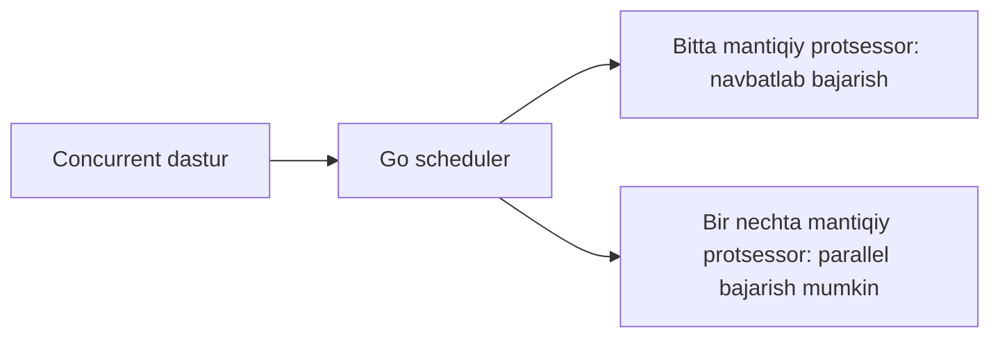

# Concurrency va parallel dasturlash

Kompyuterda bir vaqtning o‘zida brauzer, musiqa pleyeri, kod muharriri va boshqa dasturlar ishlayotgandek ko‘rinadi. Aslida buning ortida bir nechta turli mexanizm bor.

Ba’zi vazifalar CPU’da navbat bilan bajariladi. Bir vazifa vaqtincha kutishga o‘tsa, uning o‘rniga boshqa vazifa ishlashi mumkin. Boshqa holatda esa bir nechta CPU yadrosi turli vazifalarni haqiqatan ham ayni paytda bajaradi.

Shu ikki holatni tushunishda `concurrency` va `parallelism` tushunchalari muhim.

Bu darsda:

* concurrency va parallelism o‘rtasidagi farqni;
* CPU, yadro va mantiqiy protsessor tushunchalarini;
* I/O-bound va CPU-bound ishlarni;
* process, thread va goroutine farqini;
* Go runtime scheduleri qanday ishlashini;
* `GOMAXPROCS` nimani boshqarishini;
* umumiy xotirada data race qanday paydo bo‘lishini;
* concurrent dasturlarda ko‘p uchraydigan xatolarni

bosqichma-bosqich ko‘rib chiqamiz.

## CPU, yadro va mantiqiy protsessor

CPU dastur buyruqlarini bajaradi. Zamonaviy CPU odatda bir nechta fizik yadroga ega.

Har bir fizik yadro boshqa yadro bilan bir paytda alohida buyruqlarni bajarishi mumkin. Masalan, to‘rtta fizik yadro bo‘lsa, mos sharoitda bir nechta hisoblash bir vaqtning o‘zida bajarilishi mumkin.

Lekin fizik yadro bilan operatsion tizim ko‘radigan CPU soni har doim bir xil bo‘lavermaydi.

Ayrim protsessorlarda bitta fizik yadro bir nechta apparat oqimini, ya’ni **hardware thread**ni yurita oladi. Bunday texnologiya odatda **SMT — Simultaneous Multithreading** deb ataladi.

Operatsion tizim dasturlarga ko‘pincha fizik yadrolarni emas, **mantiqiy protsessorlar**ni ko‘rsatadi.

Masalan, kompyuterda:

```text
8 ta mantiqiy protsessor
```

ko‘rinishi mumkin.

Bu sakkizta mustaqil vazifa har doim sakkiz baravar tez ishlaydi degani emas.

Sababi vazifalar faqat CPU vaqtini emas, boshqa umumiy resurslarni ham ishlatadi. Masalan:

* CPU cache;
* operativ xotira;
* xotira bandwidth’i;
* disk;
* tarmoq;
* boshqa apparat resurslari.

Shuning uchun parallel ishlar bir-biriga xalaqit berishi ham mumkin.

Operatsion tizimning **scheduler**i bajarishga tayyor threadlarni mavjud mantiqiy protsessorlarga taqsimlaydi.

Bu yerda muhim jihat shuki, brauzerning har bir oynasi yoki ishlayotgan har bir dastur alohida CPU yadrosiga doimiy biriktirib qo‘yilmaydi.

Masalan, bitta thread avval birinchi yadroda ishlashi, keyin scheduler qaroriga ko‘ra boshqa yadroda davom etishi mumkin.

Demak, CPU yadrolari va ishlayotgan vazifalar o‘rtasidagi bog‘lanish doimiy emas. Operatsion tizim ularni bajarilish davomida qayta taqsimlashi mumkin.

## I/O va CPU bilan band ishlar

Dasturdagi barcha ishlar bir xil xarakterga ega emas.

Ularni vaqtning katta qismi nimaga sarflanishiga qarab ikki katta guruhga ajratish foydali:

* I/O-bound ish;
* CPU-bound ish.

Bu farq concurrency yoki parallelismdan qayerda foyda olish mumkinligini tushunishda juda muhim.

### I/O-bound ish

**I/O-bound** ish vaqtining katta qismini CPU’da hisoblashga emas, tashqi operatsiya tugashini kutishga sarflaydi.

Masalan:

* HTTP so‘roviga javob kutish;
* ma’lumotlar bazasidan natija kelishini kutish;
* fayldan ma’lumot o‘qish;
* faylga yozish;
* socket orqali ma’lumot kelishini kutish;
* foydalanuvchidan ma’lumot olish.

Masalan, dastur boshqa serverga HTTP so‘rovi yubordi:

```text
Dastur -> HTTP so‘rov -> Tarmoq -> Boshqa server
```

So‘rov yuborilgandan keyin dastur darhol natijani olmaydi. Javob tarmoq orqali qaytishi uchun vaqt kerak.

Shu kutish vaqtining katta qismida CPU ushbu vazifa uchun faol hisob-kitob bajarmaydi.

Agar dastur concurrent tuzilgan bo‘lsa, bir vazifa tarmoq javobini kutayotgan paytda CPU boshqa vazifani bajarishi mumkin.

Masalan:

```text
1-vazifa: HTTP javobini kutmoqda
2-vazifa: database natijasini qayta ishlamoqda
3-vazifa: yangi requestni qabul qilmoqda
```

Shuning uchun concurrency ayniqsa:

* backend serverlarda;
* network dasturlarda;
* database bilan ko‘p ishlaydigan dasturlarda;
* ko‘p mustaqil I/O operatsiyasi mavjud tizimlarda

foydali bo‘ladi.

Bu yerda asosiy foyda har doim bitta operatsiyani tezlashtirish emas. Ko‘pincha maqsad CPU’ni bekor kutib turmasdan boshqa foydali ish bilan band qilishdir.

### CPU-bound ish

**CPU-bound** ish vaqtining katta qismini haqiqiy hisoblashga sarflaydi.

Masalan:

* rasmni qayta ishlash;
* videoni kodlash;
* ma’lumotni siqish;
* kriptografik hisoblash;
* katta sonlar ustida matematik hisoblash;
* katta massivlar ustida murakkab algoritm bajarish.

Bunday vazifada CPU deyarli doim ish bilan band bo‘ladi.

Agar hisoblash bir-biridan mustaqil qismlarga bo‘linishi mumkin bo‘lsa va kompyuterda bir nechta CPU yadrosi mavjud bo‘lsa, ishlarni parallel bajarish umumiy vaqtni qisqartirishi mumkin.

Masalan:

```text
Katta hisoblash
    |
    +-- 1-qism -> CPU 1
    +-- 2-qism -> CPU 2
    +-- 3-qism -> CPU 3
    +-- 4-qism -> CPU 4
```

Lekin bu yerda muhim bir cheklov bor.

Parallel ishlashning ham xarajati mavjud:

* vazifalarni qismlarga bo‘lish;
* goroutine yoki threadlarni boshqarish;
* ma’lumot uzatish;
* lock va boshqa sinxronizatsiya;
* natijalarni qayta birlashtirish;
* CPU cache bilan bog‘liq xarajatlar;
* scheduler ishlashi.

Shuning uchun juda kichik hisoblashni parallel qilish ba’zan ketma-ket bajarishdan ham sekinroq chiqishi mumkin.

Demak, “ko‘proq parallelizm = har doim tezroq” degan qoida yo‘q.

Buni benchmark va profiling orqali o‘lchash kerak.

## Protsess, oqim va goroutine

Concurrency mavzusida `process`, `thread` va `goroutine` tushunchalarini bir-biridan ajratish kerak.

Ular bir-biriga bog‘liq, lekin bir xil narsa emas.

### Protsess

**Protsess (`process`)** — operatsion tizim ishga tushirgan dastur nusxasi.

Masalan, terminalda dasturni ishga tushirsak:

```bash
./server
```

operatsion tizim ushbu dastur uchun process yaratadi.

Har bir process odatda o‘z:

* virtual xotira maydoni;
* file descriptorlari;
* operatsion tizim resurslari;
* bajarilish holati

bilan ishlaydi.

Bitta process boshqa processning oddiy xotirasiga to‘g‘ridan-to‘g‘ri murojaat qilmaydi.

Processlar o‘rtasida ma’lumot almashish uchun maxsus vositalar kerak bo‘ladi. Masalan:

* network;
* pipe;
* socket;
* shared memory;
* boshqa IPC mexanizmlari.

### Oqim

**Oqim (`thread`)** — process ichidagi operatsion tizim bajarilish birligi.

Bitta process ichida bir nechta thread bo‘lishi mumkin.

Ular processning umumiy resurslarini bo‘lishadi. Masalan, bir process ichidagi threadlar odatda:

* bir xil kodga;
* bir xil heap xotirasiga;
* umumiy global ma’lumotlarga

murojaat qila oladi.

Lekin har bir threadning o‘z:

* steki;
* bajarilayotgan instruction holati;
* register holati

bo‘ladi.

Umumiy xotira threadlar o‘rtasida ma’lumot almashishni osonlashtiradi.

Lekin shu bilan birga xavf ham paydo bo‘ladi.

Agar ikki thread umumiy o‘zgaruvchini bir vaqtda o‘zgartirsa va to‘g‘ri sinxronizatsiya bo‘lmasa, data race yuz berishi mumkin.

### Goroutine

**Goroutine** — Go runtime boshqaradigan yengil bajarilish birligi.

Goroutineni operatsion tizim threadi bilan tenglashtirmaslik kerak.

Masalan:

```go
go doWork()
```

yozganimizda Go har bir `doWork()` uchun alohida operatsion tizim threadini yaratishi shart emas.

Buning o‘rniga Go runtime ko‘p goroutinelarni kamroq sondagi operatsion tizim threadlari ustida rejalashtirishi mumkin.

Soddalashtirilgan ko‘rinish:

```text
Goroutine 1 ─┐
Goroutine 2 ─┼──> Go runtime scheduler ──> OS threadlar
Goroutine 3 ─┤
Goroutine 4 ─┘
```

Shuning uchun Go dasturida minglab goroutine mavjud bo‘lishi mumkin, lekin bu minglab OS thread mavjud degani emas.

Quyidagi jadval farqni qisqacha ko‘rsatadi:

| Tushuncha | Kim boshqaradi?  | Xotira xususiyati                                            |
| --------- | ---------------- | ------------------------------------------------------------ |
| Protsess  | Operatsion tizim | Alohida virtual xotira maydoni                               |
| Thread    | Operatsion tizim | Process xotirasini boshqa threadlar bilan bo‘lishadi         |
| Goroutine | Go runtime       | Process xotirasini bo‘lishadi, kichik va o‘suvchi stekka ega |

Goroutine yaratish odatda operatsion tizim threadini yaratishdan arzonroq.

Ammo bu goroutine mutlaqo bepul degani emas.

Har bir goroutine uchun kamida:

* stek;
* runtime holati;
* scheduler bilan bog‘liq ma’lumot;
* ishlatayotgan boshqa resurslar

kerak bo‘ladi.

Shuning uchun nazoratsiz ravishda juda ko‘p goroutine yaratish muammo keltirib chiqarishi mumkin.

Masalan:

```text
1 request -> 1000 goroutine
1000 request -> 1 000 000 goroutine
```

kabi boshqarilmaydigan model xotira sarfini keskin oshirishi mumkin.

Bundan tashqari, goroutine hech qachon tugamasa, **goroutine leak** yuzaga kelishi mumkin.

## Concurrency va parallelism farqi

`Concurrency` va `parallelism` ko‘pincha bir xil ma’noda ishlatiladi. Lekin ular bir xil tushuncha emas.

### Concurrency

**Concurrency** — bir nechta mustaqil vazifani bir davr ichida boshqaradigan dastur tuzilishi.

Bu vazifalar aynan bir vaqtda ishlashi shart emas.

Masalan, bitta CPU yadrosi quyidagicha ishlashi mumkin:

```text
Vaqt --->

A A A | B B | A A | C C | B B
```

Bu yerda:

* bir oz vaqt `A` bajariladi;
* keyin `B`;
* keyin yana `A`;
* keyin `C`.

Bir vaqtning o‘zida faqat bitta vazifa CPU’da ishlayotgan bo‘lishi mumkin. Lekin bir nechta vazifa bitta vaqt oralig‘ida navbat bilan oldinga siljiydi.

Bu concurrency hisoblanadi.

### Parallelism

**Parallelism** — ikki yoki undan ortiq vazifaning haqiqatan ayni paytda bajarilishi.

Masalan, ikkita mantiqiy protsessor mavjud bo‘lsa:

```text
CPU 1: A A A A A
CPU 2: B B B B B
```

`A` va `B` vazifalari bir vaqtda bajarilishi mumkin.

Bu parallelism hisoblanadi.

Parallelism uchun bir nechta mantiqiy protsessor kerak.

### Qahvaxona misoli

Farqni oddiy misolda ko‘ramiz.

Tasavvur qiling, qahvaxonada bitta xodim ishlayapti.

U:

1. birinchi mijozning buyurtmasini oladi;
2. qahva mashinasini ishga tushiradi;
3. qahva tayyor bo‘lishini kutib turish o‘rniga ikkinchi mijozning buyurtmasini oladi;
4. keyin yana birinchi buyurtmaga qaytadi.

Bu **concurrency**.

Bitta xodim bir nechta ishni navbat bilan boshqaryapti.

Endi ikkita xodim bor deb tasavvur qilamiz.

Birinchi xodim birinchi buyurtma ustida, ikkinchi xodim esa ikkinchi buyurtma ustida ayni paytda ishlayapti.

Bu **parallelism**.

Farqni jadvalda ko‘rsak:

| Xususiyat                 | Concurrency                           | Parallelism                           |
| ------------------------- | ------------------------------------- | ------------------------------------- |
| Asosiy maqsad             | Bir nechta ishni samarali boshqarish  | Bir nechta ishni ayni paytda bajarish |
| Bitta yadroda ishlaydimi? | Ha                                    | Yo‘q                                  |
| Ko‘p uchraydigan vazifa   | I/O kutadigan server so‘rovlari       | CPU talab qiladigan hisoblashlar      |
| Asosiy foyda              | Javobchanlik va resursdan foydalanish | Hisoblash vaqtini qisqartirish        |

Bu yerda eng muhim farq quyidagicha:

> Concurrency ko‘proq dastur qanday tuzilganiga taalluqli. Parallelism esa vazifalar ma’lum bir onda qanday bajarilayotganiga taalluqli.

Concurrent yozilgan dastur har doim parallel ishlashi shart emas.

Masalan, bitta mantiqiy protsessor mavjud bo‘lsa, goroutinelar navbat bilan bajarilishi mumkin.

Bir nechta mantiqiy protsessor mavjud bo‘lsa, ularning ayrimlari parallel bajarilishi mumkin.



## Go’da birinchi concurrent dastur

Quyidagi dastur uchta turli xizmatdan ma’lumot olishni tasvirlaydi.

Haqiqiy serverga so‘rov yuborish o‘rniga `time.Sleep` orqali tarmoq yoki boshqa I/O kutishi sun’iy tarzda ko‘rsatilgan.

```go
package main

import (
	"fmt"
	"sync"
	"time"
)

func fetch(service string, delay time.Duration) string {
	time.Sleep(delay)
	return service + " javobi"
}

func main() {
	services := []string{"profil", "buyurtmalar", "tavsiyalar"}
	delays := []time.Duration{
		30 * time.Millisecond,
		10 * time.Millisecond,
		20 * time.Millisecond,
	}
	results := make([]string, len(services))

	var wg sync.WaitGroup

	for i, service := range services {
		wg.Add(1)

		go func() {
			defer wg.Done()
			results[i] = fetch(service, delays[i])
		}()
	}

	wg.Wait()

	for _, result := range results {
		fmt.Println(result)
	}
}
```

Natija:

```text
profil javobi
buyurtmalar javobi
tavsiyalar javobi
```

Endi kodni bosqichma-bosqich ko‘ramiz.

Birinchi slice xizmatlar nomini saqlaydi:

```go
services := []string{"profil", "buyurtmalar", "tavsiyalar"}
```

Ikkinchi slice har bir xizmatning qancha vaqt kutishini bildiradi:

```go
delays := []time.Duration{
	30 * time.Millisecond,
	10 * time.Millisecond,
	20 * time.Millisecond,
}
```

Demak:

```text
profil        -> 30 ms
buyurtmalar   -> 10 ms
tavsiyalar    -> 20 ms
```

Natijalar uchun oldindan uchta elementli slice yaratiladi:

```go
results := make([]string, len(services))
```

Bu yerda natijalarni aynan xizmatlar tartibida saqlash uchun indeks ishlatiladi.

Keyin `WaitGroup` yaratiladi:

```go
var wg sync.WaitGroup
```

Har bir ish boshlanishidan oldin:

```go
wg.Add(1)
```

chaqiriladi.

Bu `WaitGroup`ga:

> Yana bitta tugashini kutish kerak bo‘lgan ish bor.

degan ma’noni beradi.

Keyin anonim funksiya yangi goroutineda ishga tushadi:

```go
go func() {
	...
}()
```

Goroutine ichida birinchi muhim qator:

```go
defer wg.Done()
```

`wg.Done()` ushbu ish tugaganini bildiradi.

`defer` sabab u funksiya yakunlanayotganda chaqiriladi.

Keyin haqiqiy ish bajariladi:

```go
results[i] = fetch(service, delays[i])
```

Har bir goroutine natijani o‘z indeksiga yozadi.

Masalan:

```text
profil       -> results[0]
buyurtmalar  -> results[1]
tavsiyalar   -> results[2]
```

Shuning uchun xizmatlar turli vaqtda tugasa ham, natijalar slice ichida oldindan belgilangan joyga yoziladi.

`main` funksiyasi esa:

```go
wg.Wait()
```

qatorida barcha goroutinelar tugashini kutadi.

Shundan keyingina:

```go
for _, result := range results {
	fmt.Println(result)
}
```

natijalarni chiqaradi.

Shu sabab chiqish tugash tartibida emas, `results` slice tartibida bo‘ladi:

```text
profil javobi
buyurtmalar javobi
tavsiyalar javobi
```

Aslida `buyurtmalar` faqat `10 ms` kutadi va `profil`dan oldin tugashi mumkin.

Agar `fmt.Println` to‘g‘ridan-to‘g‘ri goroutine ichida chaqirilganida, natijalar boshqa tartibda chiqishi mumkin edi.

Masalan:

```text
buyurtmalar javobi
tavsiyalar javobi
profil javobi
```

Scheduler bajarilish tartibini qat’iy kafolatlamaydi.

Bu misolda uchta ishning kutish vaqti bir-birining ustiga tushadi:

```text
profil:       |---------- 30 ms ----------|
buyurtmalar:  |-- 10 ms --|
tavsiyalar:   |------ 20 ms ------|
```

Shuning uchun ketma-ket bajarilgandagi:

```text
30 + 10 + 20 = 60 ms
```

o‘rniga umumiy vaqt taxminan eng sekin operatsiyaga yaqinlashishi mumkin:

```text
max(30, 10, 20) ≈ 30 ms
```

Ammo bu aniq vaqt kafolati emas.

Scheduler, operatsion tizim va boshqa runtime xarajatlari ham mavjud. Haqiqiy tezlikni aniqlash uchun benchmark yoki boshqa o‘lchov kerak.

> **Ma'lumot**
>
> Goroutine va `WaitGroup` oldingi darslarda o‘rganildi. Channel esa keyingi darslarda alohida ko‘rib chiqiladi. Bu
> yerda ular concurrency va parallelism farqini amaliy misolda ko‘rsatish uchun birga ishlatilmoqda.

## Chuqurlashtirish: Go scheduler qanday ishlaydi?

Concurrency bilan ishlashni boshlash uchun schedulerning ichki modelini yodlash shart emas. Quyidagi bo‘lim goroutinelar runtime darajasida qanday rejalashtirilishini chuqurroq tushunmoqchi bo‘lgan o‘quvchilar uchun berilgan.

Go runtime’da goroutinelarni bajarishga joylashtiradigan scheduler mavjud.

Uni ko‘pincha **G–M–P modeli** orqali tushuntirishadi.

Bu modelda:

* **G** — goroutine;
* **M** — operatsion tizim threadi;
* **P** — Go kodini bajarish uchun kerak bo‘ladigan runtime resursi.

Soddalashtirilgan ko‘rinish:

```text
Goroutinelar
    |
    v
    P
    |
    v
OS thread (M)
    |
    v
CPU
```

Yoki bir nechta ish bo‘lsa:

```text
G1 ─┐
G2 ─┤
G3 ─┼──> P lar ───> M lar ───> CPU
G4 ─┤
G5 ─┘
```

Scheduler bajarishga tayyor goroutinelarni `P` orqali `M`larga biriktiradi.

Bu modelning maqsadi ko‘p goroutinelarni samarali ravishda kamroq sondagi operatsion tizim threadlari ustida ishlatishdir.

Masalan, goroutine quyidagi operatsiyalardan biri sabab kutishga o‘tishi mumkin:

* channel operatsiyasi;
* mutex;
* timer;
* network I/O;
* boshqa bloklovchi ish.

Bir goroutine kutayotganida runtime mavjud CPU vaqtini bekor sarflash o‘rniga boshqa tayyor goroutineni bajarishga harakat qilishi mumkin.

Masalan:

```text
G1 -> network javobini kutmoqda
G2 -> bajarishga tayyor
```

Bunday paytda scheduler `G2`ni ishlatishi mumkin.

Ayrim bloklovchi tizim chaqiruvlarida OS threadning o‘zi band bo‘lib qolishi mumkin. Runtime bunday holatda boshqa threaddan foydalanib, boshqa goroutinelarning ishlashini davom ettirishi mumkin.

### `GOMAXPROCS`

Go runtime’da `runtime.GOMAXPROCS` degan muhim tushuncha bor.

U bir paytda Go kodini bajarishda qatnasha oladigan `P`lar sonini belgilaydi.

Bu yerda keng tarqalgan chalkashlik bor:

> `GOMAXPROCS` goroutinelar sonini cheklamaydi.

Masalan, dasturda:

```text
1000 ta goroutine
```

bo‘lishi mumkin.

Lekin `GOMAXPROCS`:

```text
4
```

bo‘lsa, ma’lum bir onda Go kodini parallel bajarish imkoniyati `P`lar soni bilan cheklanadi.

Soddalashtirib:

```text
1000 goroutine
      |
      v
4 ta P
      |
      v
parallel Go bajarilishi
```

Joriy CPU va `GOMAXPROCS` qiymatini quyidagicha ko‘rish mumkin:

```go
package main

import (
	"fmt"
	"runtime"
)

func main() {
	fmt.Println("Mantiqiy CPU:", runtime.NumCPU())
	fmt.Println("GOMAXPROCS:", runtime.GOMAXPROCS(0))
}
```

Masalan, natija shunday bo‘lishi mumkin:

```text
Mantiqiy CPU: 8
GOMAXPROCS: 8
```

Lekin bu qiymatlar kompyuter va dastur ishlayotgan muhitga bog‘liq.

Quyidagi qator:

```go
runtime.NumCPU()
```

Go runtime ko‘rayotgan mantiqiy CPU sonini qaytaradi.

Bu qator esa:

```go
runtime.GOMAXPROCS(0)
```

joriy `GOMAXPROCS` qiymatini qaytaradi.

Bu yerda `0` qiymati:

> Yangi limit o‘rnatma, faqat hozirgi qiymatni qaytar.

degan ma’noda ishlatiladi.

> **Diqqat**
>
> `GOMAXPROCS`ni mantiqiy CPU sonidan kattalashtirish CPU-bound kodni avtomatik tezlashtirmaydi. Aksincha, ortiqcha parallelizm scheduler ishini, context almashishni va CPU cache bilan bog‘liq xarajatlarni oshirishi mumkin.

## Umumiy xotira va data race

Goroutinelar bitta process ichida ishlaydi.

Shuning uchun ular process xotirasini o‘zaro bo‘lishadi.

Bu juda qulay. Masalan, bir nechta goroutine bir xil slice, map yoki struct bilan ishlashi mumkin.

Lekin umumiy xotira bilan ishlashda sinxronizatsiya muhim.

Agar:

1. ikki yoki undan ortiq goroutine bir xil xotira joyiga murojaat qilsa;
2. ulardan kamida bittasi yozish bajarsa;
3. ular orasida kerakli sinxronizatsiya bo‘lmasa;

**data race** yuzaga kelishi mumkin.

Quyidagi kod ataylab noto‘g‘ri:

```go
// Noto‘g‘ri misol: bir nechta goroutine count qiymatiga
// sinxronizatsiyasiz yozadi.
// count++ bitta atomar amal emas.
// go func() {
//     count++
// }()
```

Birinchi qarashda:

```go
count++
```

bitta amalga o‘xshaydi.

Lekin konseptual jihatdan uni quyidagi bosqichlarga ajratish mumkin:

```text
1. count qiymatini o‘qish
2. qiymatni 1 ga oshirish
3. yangi qiymatni count ga yozish
```

Masalan, `count = 0` bo‘lsin.

Ikki goroutine bir vaqtda ishlasa:

```text
G1: count ni o‘qidi -> 0
G2: count ni o‘qidi -> 0

G1: 0 + 1 -> 1
G2: 0 + 1 -> 1

G1: count = 1
G2: count = 1
```

Biz ikkita oshirish bajarildi deb o‘ylagan edik.

Kutilgan natija:

```text
2
```

Lekin ayrim bajarilishlarda natija:

```text
1
```

bo‘lishi mumkin.

Bu **lost update** kabi muammolarga olib keladi.

Yana muhim jihat:

> Dastur bir necha marta to‘g‘ri natija chiqargani uning race’dan holi ekanini isbotlamaydi.

Data race schedulerning aniq bajarilish tartibiga bog‘liq bo‘lishi mumkin.

Umumiy holatni xavfsiz boshqarish uchun turli yondashuvlar mavjud.

Masalan:

* holatni channel orqali bitta goroutinega berish;
* `sync.Mutex`;
* `sync.RWMutex`;
* `sync/atomic`;
* boshqa mos sinxronizatsiya mexanizmlari.

Go race detector ham race muammolarini topishda yordam beradi.

Testlarni race detector bilan ishga tushirish:

```bash
go test -race ./...
```

Oddiy dasturni race detector bilan ishga tushirish:

```bash
go run -race main.go
```

Agar bajarilish vaqtida data race kuzatilsa, race detector bu haqda xabar berishi mumkin.

Lekin bu yerda muhim cheklov bor.

Race detector barcha nazariy bajarilish yo‘llarini avtomatik tekshirib chiqmaydi. U dastur real bajarilish vaqtida kuzatilgan xotira murojaatlarini tahlil qiladi.

Shuning uchun:

```text
Race detector xato topmadi
```

degani:

```text
Dasturda data race bo‘lishi mutlaqo mumkin emas
```

degan kafolat emas.

Testlar race yuz beradigan kod yo‘lini ishlatishi ham kerak.

## Keng tarqalgan xatolar

Concurrent dastur yozishda bir nechta xato juda ko‘p uchraydi.

### Concurrencyni tezlik bilan tenglashtirish

Goroutine qo‘shish kodni avtomatik tezlashtirmaydi.

Masalan, quyidagi fikr noto‘g‘ri:

```text
1 goroutine yaxshi
10 goroutine undan tez
1000 goroutine yanada tez
```

Haqiqiy ishlash tezligiga ko‘p omillar ta’sir qiladi:

* ketma-ket bajarilishi shart bo‘lgan kod;
* locklar;
* ma’lumot uzatish;
* scheduler;
* memory allocation;
* CPU cache;
* I/O cheklovlari;
* tashqi servislar limiti.

CPU-bound ishda qo‘shimcha goroutinelar mavjud CPU sonidan foyda olishga yordam berishi mumkin.

Lekin juda ko‘p parallel ish yaratish aksincha overheadni oshiradi.

I/O-bound ishda esa concurrency ko‘pincha kutish vaqtlarini bir-birining ustiga tushirishga yordam beradi.

Shuning uchun amaliy yondashuv odatda quyidagicha:

```text
1. Avval sodda va to‘g‘ri yechim yozish
2. Benchmark yoki profiling qilish
3. Tor joyni aniqlash
4. Faqat kerakli joyda concurrency qo‘llash
5. Yana o‘lchash
```

### Cheksiz goroutine yaratish

Har bir ish uchun nazoratsiz goroutine yaratish xavfli.

Masalan:

```go
for item := range items {
	go process(item)
}
```

agar `items` soni juda katta bo‘lsa, juda ko‘p goroutine bir vaqtda yaratilishi mumkin.

Bu faqat Go process xotirasiga emas, tashqi tizimlarga ham bosim beradi.

Masalan:

* database connectionlar tugashi;
* tashqi API rate limitga urilishi;
* file descriptorlar tugashi;
* xotira sarfining keskin oshishi;
* schedulerga yuk ortishi.

Shuning uchun bir vaqtda bajariladigan ishlar sonini cheklash kerak.

Buning uchun ko‘pincha:

* semaphore;
* worker pool;
* bounded queue

kabi yondashuvlar ishlatiladi.

Masalan, tizimda 100 000 ta ish bo‘lishi mumkin. Lekin ularning faqat 20 tasi bir vaqtda bajarilishi mumkin.

```text
100 000 ish
     |
     v
queue
     |
     v
20 worker
```

Bu resurslardan nazoratli foydalanishga yordam beradi.

### Goroutine tugashini kutmaslik

Go dasturida `main` funksiyasi qaytsa, process yakunlanadi.

Runtime qolgan goroutinelarni avtomatik ravishda:

> Hamma ishini tugatguncha kutaman.

deb kutib turmaydi.

Masalan:

```go
func main() {
	go doWork()
}
```

`main()` juda tez tugasa, `doWork()` tugashga ulgurmasligi mumkin.

Shuning uchun goroutinelarning tugashini aniq sinxronizatsiya mexanizmi bilan kutish kerak.

Masalan:

* `sync.WaitGroup`;
* channel;
* boshqa mos koordinatsiya usuli.

Quyidagi usul esa ishonchli sinxronizatsiya emas:

```go
time.Sleep(time.Second)
```

Bunda dastur:

> Bir soniya yetarli bo‘lsa kerak.

deb taxmin qiladi.

Lekin ish ba’zan `500 ms`, ba’zan `2 s` davom etishi mumkin.

To‘g‘ri yechim ishning haqiqiy tugash signalini kutishi kerak.

### Goroutine leak

**Goroutine leak** — goroutine endi foydali ish bajarmayotgan bo‘lsa ham, hech qachon tugamay qoladigan holat.

Masalan, goroutine channel’dan qiymat kutmoqda:

```go
value := <-ch
```

Lekin `ch`ga hech kim hech qachon qiymat yubormaydi.

Natijada goroutine doimiy kutishda qolishi mumkin.

Shunga o‘xshash muammolar quyidagilarda ham paydo bo‘lishi mumkin:

* tugamaydigan I/O;
* yuborilmaydigan signal;
* to‘xtatilmaydigan retry;
* yopilmay qolgan worker;
* timeout bo‘lmagan tashqi chaqiruv.

Goroutine CPU ishlatmayotgan bo‘lishi mumkin, lekin u baribir runtime holati va boshqa resurslarni saqlab turadi.

Backend dasturlarda uzoq davom etadigan ishlar uchun:

* cancellation;
* deadline;
* timeout

mexanizmlarini aniq belgilash muhim.

Go’da buning uchun ko‘pincha `context.Context` ishlatiladi.

### Natija tartibiga tayanish

Scheduler goroutinelarni qaysi tartibda bajarishini kafolatlamaydi.

Masalan:

```go
go first()
go second()
```

yozilgan bo‘lsa, bu:

```text
first albatta to‘liq tugaydi
keyin second ishlaydi
```

degani emas.

Hatto `first` goroutine oldin yaratilgan bo‘lsa ham, `second` oldin natija chiqarishi mumkin.

Concurrent dastur mantiqini tasodifiy scheduler tartibiga bog‘lamaslik kerak.

Agar ma’lum tartib talab qilinsa, uni dasturda ochiq belgilash kerak.

Masalan:

* channel;
* `WaitGroup`;
* indeks;
* mutex;
* boshqa koordinatsiya mexanizmi.

## Ishlash tezligini to‘g‘ri baholash

Parallel yoki concurrent yechimni tanlashdan oldin kodning haqiqiy xarakterini tushunish kerak.

Quyidagi savollar foydali:

* Ish I/O-boundmi yoki CPU-boundmi?
* Vazifalarni mustaqil qismlarga bo‘lish mumkinmi?
* Bir qism boshqasining natijasiga bog‘liqmi?
* Umumiy xotira ishlatiladimi?
* Umumiy xotiraga murojaat xavfsizmi?
* Parallel ishlar soni cheklanganmi?
* Tashqi servis qancha parallel so‘rovni ko‘tara oladi?
* Xatolar qanday tarqatiladi?
* Timeout qanday ishlaydi?
* Bekor qilish signali qanday yetkaziladi?
* Ketma-ket va concurrent variant benchmarkda qanday farq qiladi?

Tezlikni baholashda **latency** va **throughput** tushunchalarini ham ajratish muhim.

### Latency

**Latency** — bitta operatsiya yoki so‘rovning boshlanishidan tugashigacha ketgan vaqt.

Masalan:

```text
Request boshlandi: 10:00:00.000
Request tugadi:     10:00:00.050
```

Latency:

```text
50 ms
```

### Throughput

**Throughput** — ma’lum vaqt ichida qancha ish bajarilganini bildiradi.

Masalan:

```text
1000 request / sekund
```

Bu throughput.

Concurrency ba’zan bitta requestning latency qiymatini deyarli o‘zgartirmaydi, lekin tizimning throughputini oshirishi mumkin.

Masalan, har bir request tashqi servisni `50 ms` kutadi.

Bitta requestning latency qiymati hali ham taxminan:

```text
50 ms
```

bo‘lishi mumkin.

Lekin server bir vaqtning o‘zida ko‘p requestni kutishga qo‘ya olsa, bir sekund ichida bajariladigan requestlar soni oshishi mumkin.

Shuning uchun:

> Latency yaxshilandi.

va:

> Throughput yaxshilandi.

bir xil fikr emas.

Birini yaxshilash har doim ikkinchisini ham yaxshilamaydi.

## Interviewda nimalarga e’tibor beriladi?

Concurrency mavzusidagi interview savollarida odatda faqat ta’rif emas, tushunchalar orasidagi farqni anglash muhim.

Quyidagi fikrlarni aniq tushuntira olish kerak.

**Concurrency — dastur tuzilishi, parallelism esa bajarilish xususiyati.**

Concurrent dastur bir nechta vazifani bir davr ichida boshqaradi. Ular bitta CPU’da navbat bilan bajarilishi ham mumkin.

Parallelism esa bir nechta vazifaning ayni paytda bajarilishini anglatadi.

**Goroutine operatsion tizim threadi emas.**

Goroutine Go runtime tomonidan boshqariladi. Runtime ko‘p goroutinelarni OS threadlar ustida rejalashtiradi.

**`GOMAXPROCS` goroutine sonini cheklamaydi.**

Dasturda juda ko‘p goroutine bo‘lishi mumkin. `GOMAXPROCS` esa bir paytda Go kodini parallel bajarishda qatnasha oladigan `P`lar soniga ta’sir qiladi.

**Umumiy xotiraga sinxronizatsiyasiz yozish data race keltirib chiqarishi mumkin.**

Ayniqsa bir nechta goroutine bir xil qiymatni o‘zgartirayotgan bo‘lsa, kerakli sinxronizatsiya bo‘lishi kerak.

**Concurrency tezlikni kafolatlamaydi.**

Goroutine qo‘shishning o‘zi optimizatsiya emas. Har qanday tezlik haqidagi xulosani benchmark yoki profiling bilan tekshirish kerak.

**Goroutinelar soni nazorat qilinishi kerak.**

Nazoratsiz goroutine yaratish xotira, database connection, tashqi servis yoki boshqa resurslarni tugatishi mumkin.

## Misollar

### 1. Ketma-ket bajarilish vaqtini o‘lchash

Bu misol ikki ishni ketma-ket bajaradi.

Maqsad — keyingi concurrent misol bilan solishtirish uchun boshlang‘ich vaqtni ko‘rish.

```go
package main

import (
	"fmt"
	"time"
)

func work(name string) {
	time.Sleep(100 * time.Millisecond)
	fmt.Println(name, "tugadi")
}

func main() {
	started := time.Now()

	work("birinchi ish")
	work("ikkinchi ish")

	fmt.Println("Umumiy vaqt:", time.Since(started))
}
```

`work()` funksiyasi:

```go
time.Sleep(100 * time.Millisecond)
```

qatori orqali `100` millisekund kutadi.

Birinchi chaqiruv:

```go
work("birinchi ish")
```

tugamaguncha keyingi qator bajarilmaydi.

Shundan keyin:

```go
work("ikkinchi ish")
```

boshlanadi.

Vaqt oqimini soddalashtirib ko‘rsak:

```text
birinchi ish: |-------- 100 ms --------|
ikkinchi ish:                           |-------- 100 ms --------|
```

Shuning uchun umumiy kutish taxminan:

```text
100 ms + 100 ms = 200 ms
```

bo‘ladi.

Natija taxminan:

```text
birinchi ish tugadi
ikkinchi ish tugadi
Umumiy vaqt: 200...
```

ko‘rinishida chiqadi.

Aniq qiymat aynan `200 ms` bo‘lishi shart emas. Scheduler va boshqa tizim xarajatlari sabab biroz katta bo‘lishi mumkin.

Bu misoldagi asosiy qoida:

> Ketma-ket bajarilishda ikkinchi ish birinchi ish tugamaguncha boshlanmaydi.

### 2. Kutish vaqtlarini ustma-ust bajarish

Bu misolda ikki kutuvchi ish alohida goroutineda boshlanadi.

```go
package main

import (
	"fmt"
	"time"
)

func waitForService(name string) {
	time.Sleep(100 * time.Millisecond)
	fmt.Println(name, "javob berdi")
}

func main() {
	started := time.Now()

	go waitForService("API")
	go waitForService("ma’lumotlar bazasi")

	time.Sleep(150 * time.Millisecond)
	fmt.Println("O‘tgan vaqt:", time.Since(started))
}
```

Bu safar:

```go
go waitForService("API")
```

va:

```go
go waitForService("ma’lumotlar bazasi")
```

alohida goroutinelarda boshlanadi.

Shuning uchun ikkala `100 ms` kutish ketma-ket emas, bir vaqt oralig‘ida davom etishi mumkin:

```text
API:                 |-------- 100 ms --------|
ma’lumotlar bazasi:  |-------- 100 ms --------|
```

Ketma-ket variantda umumiy kutish:

```text
100 + 100 = 200 ms
```

edi.

Concurrent holatda ikkala kutish bir-birining ustiga tushadi. Shu sabab ikkala ish taxminan `100 ms` atrofida tugashi mumkin.

Koddagi:

```go
time.Sleep(150 * time.Millisecond)
```

qatori esa goroutinelarning tugashini kutish uchun qo‘yilgan.

Lekin bu real dastur uchun to‘g‘ri sinxronizatsiya usuli emas.

Sababi `Sleep()`:

> Ish tugaguncha kut.

demaydi.

U faqat:

> Shu vaqt davomida kut.

deydi.

Real kodda `WaitGroup`, channel yoki boshqa aniq sinxronizatsiya usuli ishlatilishi kerak.

Bu misoldagi asosiy qoida:

> I/O kabi kutuvchi mustaqil ishlar concurrent boshlansa, ularning kutish vaqti bir-birining ustiga tushishi mumkin.

### 3. Mantiqiy protsessorlar sonini ko‘rish

Bu misolda Go runtime ko‘rayotgan mantiqiy protsessorlar soni chiqariladi.

```go
package main

import (
	"fmt"
	"runtime"
)

func main() {
	logicalCPU := runtime.NumCPU()
	fmt.Println("Mantiqiy protsessorlar:", logicalCPU)
}
```

Asosiy qator:

```go
logicalCPU := runtime.NumCPU()
```

`runtime.NumCPU()` dastur ishlayotgan muhitda Go runtime ko‘rayotgan mantiqiy CPU sonini qaytaradi.

Masalan:

```text
Mantiqiy protsessorlar: 8
```

chiqishi mumkin.

Boshqa kompyuterda:

```text
Mantiqiy protsessorlar: 4
```

bo‘lishi mumkin.

Qiymat dastur ishlayotgan muhitga bog‘liq.

Bu sonni goroutinelar soni bilan tenglashtirmaslik kerak.

Masalan:

```text
8 mantiqiy CPU
```

mavjud bo‘lsa ham dasturda:

```text
10 000 goroutine
```

bo‘lishi mumkin.

Goroutinelar Go runtime tomonidan mantiqiy CPUlar ustida rejalashtiriladi.

Bu misoldagi asosiy qoida:

> Mantiqiy CPU soni goroutine soni emas. U apparat va runtime bajarilish imkoniyatini ifodalaydi.

### 4. `GOMAXPROCS` qiymatini o‘qish

Bu misolda bir paytda Go kodini bajarish uchun ishlatiladigan `GOMAXPROCS` qiymati ko‘rsatiladi.

```go
package main

import (
	"fmt"
	"runtime"
)

func main() {
	current := runtime.GOMAXPROCS(0)
	fmt.Println("GOMAXPROCS:", current)
}
```

Asosiy qator:

```go
current := runtime.GOMAXPROCS(0)
```

Bu yerda `0` yangi qiymat o‘rnatmaydi.

U faqat joriy `GOMAXPROCS` qiymatini so‘raydi.

Masalan:

```text
GOMAXPROCS: 8
```

chiqishi mumkin.

`GOMAXPROCS` goroutine sonini cheklamaydi.

Masalan:

```text
Goroutine soni: 5000
GOMAXPROCS:     8
```

bo‘lishi mumkin.

Bu holatda 5000 goroutine mavjud, lekin ularning barchasi ayni paytda Go kodini parallel bajarmaydi.

Bu misoldagi asosiy qoida:

> `GOMAXPROCS` goroutine sonini emas, parallel Go bajarilish imkoniyatini boshqaradi.

### 5. Schedulerga ixtiyoriy navbat berish

Bu misolda `runtime.Gosched()` ishlatiladi.

```go
package main

import (
	"fmt"
	"runtime"
	"time"
)

func main() {
	go func() {
		fmt.Println("Yordamchi goroutine ishladi")
	}()

	runtime.Gosched()

	time.Sleep(10 * time.Millisecond)
	fmt.Println("main tugadi")
}
```

Avval yordamchi goroutine yaratiladi:

```go
go func() {
	fmt.Println("Yordamchi goroutine ishladi")
}()
```

Keyin:

```go
runtime.Gosched()
```

chaqiriladi.

`Gosched()` joriy goroutineni tugatmaydi.

U schedulerga boshqa tayyor goroutinelarni bajarish uchun imkon beradi.

Soddalashtirib:

```text
main ishlayapti
     |
     v
Gosched()
     |
     v
scheduler boshqa tayyor goroutineni ishlatishi mumkin
```

Lekin `Gosched()` qat’iy bajarilish tartibini kafolatlovchi sinxronizatsiya vositasi emas.

Koddagi:

```go
time.Sleep(10 * time.Millisecond)
```

faqat kichik namunaning chiqishini ko‘rish uchun qoldirilgan.

Real dasturda vazifalar tartibi yoki tugashi `Gosched()` va `Sleep()` taxminiga bog‘lanmasligi kerak.

Bu misoldagi asosiy qoida:

> `runtime.Gosched()` schedulerga boshqa goroutinelarni bajarish imkonini beradi, lekin bajarilish tartibini kafolatlamaydi.

### 6. Mustaqil hisoblarni concurrent boshlash

Bu misolda bir-biriga bog‘liq bo‘lmagan ikkita hisob alohida goroutineda bajariladi.

```go
package main

import (
	"fmt"
	"time"
)

func square(number int) {
	fmt.Println(number, "kvadrati:", number*number)
}

func cube(number int) {
	fmt.Println(number, "kubi:", number*number*number)
}

func main() {
	go square(4)
	go cube(3)

	time.Sleep(20 * time.Millisecond)
}
```

Birinchi funksiya:

```go
square(4)
```

quyidagi hisobni bajaradi:

```text
4 * 4 = 16
```

Ikkinchi funksiya:

```go
cube(3)
```

quyidagi hisobni bajaradi:

```text
3 * 3 * 3 = 27
```

Bu ikki hisob bir-biriga bog‘liq emas.

`square(4)` natijasi `cube(3)` uchun kerak emas. `cube(3)` natijasi ham `square(4)`ga kerak emas.

Shuning uchun ularni mustaqil goroutinelarda boshlash mumkin:

```go
go square(4)
go cube(3)
```

Natija quyidagicha chiqishi mumkin:

```text
4 kvadrati: 16
3 kubi: 27
```

Lekin aksincha tartib ham mumkin:

```text
3 kubi: 27
4 kvadrati: 16
```

Sababi scheduler qaysi goroutine birinchi ishlashini kafolatlamaydi.

Bu misoldagi asosiy qoida:

> Mustaqil ishlarni concurrent boshlash mumkin, lekin ularning tugash tartibiga tayanish kerak emas.

### 7. Scheduler tartibiga tayanmaslik

Bu misolda ikki goroutine turli davomiylikda kutadi.

```go
package main

import (
	"fmt"
	"time"
)

func task(name string, delay time.Duration) {
	time.Sleep(delay)
	fmt.Println(name)
}

func main() {
	go task("sekin", 60*time.Millisecond)
	go task("tez", 10*time.Millisecond)

	time.Sleep(80 * time.Millisecond)
}
```

Kodda `sekin` goroutine birinchi yozilgan:

```go
go task("sekin", 60*time.Millisecond)
```

Keyin `tez` goroutine yaratilgan:

```go
go task("tez", 10*time.Millisecond)
```

Lekin ularning kutish vaqti har xil:

```text
sekin -> 60 ms
tez   -> 10 ms
```

Vaqt chizig‘i:

```text
sekin: |---------------- 60 ms ----------------|
tez:   |--- 10 ms ---|
```

Shuning uchun `tez` odatda oldin chiqadi:

```text
tez
sekin
```

Bu juda muhim qoida.

Kodda goroutine oldin yozilgani uning oldin tugashini anglatmaydi.

Umuman, concurrent kodni:

```text
Bu goroutine avval yozilgan, demak u avval tugaydi.
```

degan taxminga qurmaslik kerak.

Tartib zarur bo‘lsa, uni alohida sinxronizatsiya qilish kerak.

Bu misoldagi asosiy qoida:

> Goroutinelarning kodda yozilish tartibi ularning tugash tartibini kafolatlamaydi.

### 8. Umumiy xotiradagi data race

Bu misolda ikkita goroutine bir xil `counter` qiymatini sinxronizatsiyasiz o‘zgartiradi.

```go
package main

import (
	"fmt"
	"time"
)

func main() {
	counter := 0

	go func() {
		counter++
	}()

	go func() {
		counter++
	}()

	time.Sleep(20 * time.Millisecond)
	fmt.Println(counter)
}
```

`counter` boshlang‘ich holatda:

```text
0
```

Birinchi goroutine:

```go
counter++
```

bajaradi.

Ikkinchi goroutine ham aynan shu umumiy o‘zgaruvchiga:

```go
counter++
```

bajaradi.

Muammo shundaki, `counter++`ni umumiy xotira nuqtai nazaridan bitta ajralmas amal deb hisoblash mumkin emas.

Konseptual ravishda:

```text
o‘qish
oshirish
yozish
```

bosqichlari mavjud.

Masalan:

```text
counter = 0

G1: counter ni o‘qidi -> 0
G2: counter ni o‘qidi -> 0

G1: 1 hosil qildi
G2: 1 hosil qildi

G1: counter = 1
G2: counter = 1
```

Natijada ikkita oshirish bo‘lsa ham, yakuniy qiymat `1` bo‘lib qolishi mumkin.

Bundan tashqari, bu kodda `main` ham `counter`ni o‘qiydi:

```go
fmt.Println(counter)
```

Bu murojaatlarning o‘zi ham to‘g‘ri sinxronizatsiya qilinmagan.

Muammoni race detector bilan ko‘rish mumkin:

```bash
go run -race main.go
```

Koddagi:

```go
time.Sleep(20 * time.Millisecond)
```

data raceni bartaraf qilmaydi.

`Sleep()` faqat vaqt o‘tishini kutadi. U xotira murojaatlari orasida kerakli sinxronizatsiya yaratmaydi.

Bu misoldagi asosiy qoida:

> Bir xil umumiy xotiraga sinxronizatsiyasiz concurrent yozish data race keltirib chiqarishi mumkin.

### 9. Turli xotira manzillariga yozish

Bu misolda ikki goroutine bitta slicening turli elementlariga yozadi.

```go
package main

import (
	"fmt"
	"time"
)

func main() {
	values := make([]int, 2)

	go func() {
		values[0] = 25
	}()

	go func() {
		values[1] = 50
	}()

	time.Sleep(20 * time.Millisecond)
	fmt.Println("Hisoblar tugadi")
}
```

Avval uzunligi `2` bo‘lgan slice yaratiladi:

```go
values := make([]int, 2)
```

Unda quyidagi indekslar mavjud:

```text
values[0]
values[1]
```

Birinchi goroutine:

```go
values[0] = 25
```

yozadi.

Ikkinchi goroutine:

```go
values[1] = 50
```

yozadi.

Bu ikki amal bir xil slice obyektiga tegishli bo‘lsa ham, ikki xil elementga yozmoqda:

```text
goroutine 1 -> values[0]
goroutine 2 -> values[1]
```

Ya’ni ular aynan bir xotira manziliga yozmayapti.

Bundan tashqari, bu misolda `main()` goroutinelar yozayotgan paytda elementlarning qiymatini o‘qimaydi.

U faqat:

```go
fmt.Println("Hisoblar tugadi")
```

qatorini chiqaradi.

Shu sabab bu misol oldingi `counter++` holatidan farq qiladi.

Lekin `time.Sleep()` bu yerda ham ishlarning tugashini to‘g‘ri sinxronizatsiya qiluvchi vosita emas. Real dasturda aniq tugash signali ishlatilishi kerak.

Bu misoldagi asosiy qoida:

> Turli goroutinelar bir-biridan mustaqil xotira joylari bilan ishlasa, bir xil o‘zgaruvchiga concurrent yozishdagi muammo yuz bermaydi. Lekin goroutinelarning tugashini baribir to‘g‘ri sinxronizatsiya qilish kerak.

### 10. Latency va throughputni ajratish

Bu misolda bitta ishning latency qiymati bilan bir nechta concurrent ishning umumiy bajarilish vaqti orasidagi farq ko‘rsatiladi.

```go
package main

import (
	"fmt"
	"time"
)

func request(id int) {
	time.Sleep(50 * time.Millisecond)
	fmt.Println("So‘rov tugadi:", id)
}

func main() {
	started := time.Now()

	for id := 1; id <= 3; id++ {
		go request(id)
	}

	time.Sleep(80 * time.Millisecond)
	fmt.Println("Uch so‘rov uchun vaqt:", time.Since(started))
}
```

Har bir `request()` funksiyasi:

```go
time.Sleep(50 * time.Millisecond)
```

orqali taxminan `50 ms` kutadi.

Demak, bitta so‘rovning latency qiymati taxminan:

```text
50 ms
```

bo‘lib qoladi.

Endi uchta request ketma-ket bajarilganini tasavvur qilamiz:

```text
request 1: |---- 50 ms ----|
request 2:                  |---- 50 ms ----|
request 3:                                   |---- 50 ms ----|
```

Umumiy vaqt taxminan:

```text
50 + 50 + 50 = 150 ms
```

bo‘lardi.

Lekin kodda requestlar goroutine orqali concurrent boshlanadi:

```go
for id := 1; id <= 3; id++ {
	go request(id)
}
```

Shuning uchun kutishlar bir-birining ustiga tushishi mumkin:

```text
request 1: |---- 50 ms ----|
request 2: |---- 50 ms ----|
request 3: |---- 50 ms ----|
```

Bitta requestning latency qiymati taxminan `50 ms`ligicha qoladi.

Lekin uchta requestning bajarilishi `150 ms`ga ketma-ket yig‘ilmaydi.

Bu throughput nuqtai nazaridan foydali bo‘lishi mumkin: bir vaqt oralig‘ida ko‘proq request ustida ishlash imkoniyati paydo bo‘ladi.

Kodda `id`:

```go
for id := 1; id <= 3; id++ {
```

ko‘rinishida `1`dan boshlanadi.

Buning texnik zarurati yo‘q. Bu faqat natijani o‘quvchiga qulay:

```text
So‘rov tugadi: 1
So‘rov tugadi: 2
So‘rov tugadi: 3
```

ko‘rinishida chiqarish uchun tanlangan.

Yana bir bor, bu misoldagi:

```go
time.Sleep(80 * time.Millisecond)
```

faqat kichik demonstratsiya uchun ishlatilgan.

Real dasturda uchta goroutine haqiqatan tugaganini `WaitGroup`, channel yoki boshqa sinxronizatsiya mexanizmi orqali aniqlash kerak.

Bu misoldagi asosiy qoida:

> Concurrency bitta operatsiyaning latency qiymatini o‘zgartirmasdan ham bir vaqt oralig‘ida ko‘proq ishni bajarish, ya’ni throughputni oshirish imkonini berishi mumkin.
