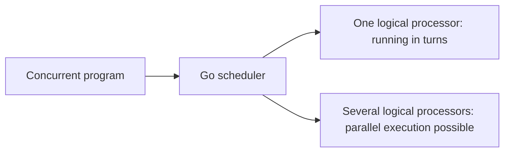

# Concurrency and parallel programming

On a computer it looks as if the browser, a music player, a code editor and other programs are all running at the same time. In fact, several different mechanisms are behind this.

Some tasks are run on the CPU in turns. If one task temporarily starts waiting, another task can run in its place. In other cases several CPU cores really run different tasks at the same moment.

The concepts of `concurrency` and `parallelism` are important for understanding these two situations.

In this lesson we will look step by step at:

* the difference between concurrency and parallelism;
* the concepts of CPU, core and logical processor;
* I/O-bound and CPU-bound work;
* the difference between a process, a thread and a goroutine;
* how the Go runtime scheduler works;
* what `GOMAXPROCS` controls;
* how a data race appears in shared memory;
* common mistakes in concurrent programs.

## CPU, core and logical processor

The CPU executes program instructions. A modern CPU usually has several physical cores.

Each physical core can execute separate instructions at the same time as another core. For example, with four physical cores, several computations can run at the same time under suitable conditions.

But the number of physical cores and the number of CPUs the operating system sees are not always the same.

On some processors one physical core can run several hardware streams, that is, **hardware threads**. Such technology is usually called **SMT — Simultaneous Multithreading**.

The operating system often shows programs not physical cores but **logical processors**.

For example, a computer may show:

```text
8 logical processors
```

This does not mean eight independent tasks always run eight times faster.

The reason is that tasks use not only CPU time but other shared resources too. For example:

* the CPU cache;
* main memory;
* memory bandwidth;
* the disk;
* the network;
* other hardware resources.

That is why parallel work can also interfere with each other.

The operating system's **scheduler** distributes threads that are ready to run across the available logical processors.

The important point here is that each browser window or each running program is not permanently attached to a separate CPU core.

For example, a thread may first run on the first core and then, by the scheduler's decision, continue on another core.

So the connection between CPU cores and running tasks is not permanent. The operating system can redistribute them during execution.

## Work bound by I/O and by the CPU

Not all work in a program has the same character.

It helps to divide it into two big groups depending on what most of the time is spent on:

* I/O-bound work;
* CPU-bound work.

This difference is very important for understanding where concurrency or parallelism can help.

### I/O-bound work

**I/O-bound** work spends most of its time not computing on the CPU, but waiting for an external operation to finish.

For example:

* waiting for a response to an HTTP request;
* waiting for a result from the database;
* reading data from a file;
* writing to a file;
* waiting for data to arrive over a socket;
* getting input from the user.

For example, the program sent an HTTP request to another server:

```text
Program -> HTTP request -> Network -> Other server
```

After the request is sent, the program does not get the result immediately. It takes time for the response to come back over the network.

During most of this waiting time the CPU does no active computation for this task.

If the program is built concurrently, the CPU can run another task while one task waits for the network response.

For example:

```text
Task 1: waiting for the HTTP response
Task 2: processing the database result
Task 3: accepting a new request
```

That is why concurrency is especially useful:

* in backend servers;
* in network programs;
* in programs that work a lot with databases;
* in systems with many independent I/O operations.

The main benefit here is not always speeding up a single operation. Often the goal is to keep the CPU busy with other useful work instead of waiting idle.

### CPU-bound work

**CPU-bound** work spends most of its time on actual computation.

For example:

* image processing;
* video encoding;
* data compression;
* cryptographic computation;
* mathematical computation on large numbers;
* running a complex algorithm on large arrays.

In such a task the CPU is almost always busy.

If the computation can be split into independent parts and the computer has several CPU cores, running the work in parallel can shorten the total time.

For example:

```text
Big computation
    |
    +-- part 1 -> CPU 1
    +-- part 2 -> CPU 2
    +-- part 3 -> CPU 3
    +-- part 4 -> CPU 4
```

But there is an important limitation here.

Parallel work has its own cost too:

* splitting tasks into parts;
* managing goroutines or threads;
* passing data;
* locks and other synchronization;
* combining results again;
* costs related to the CPU cache;
* the work of the scheduler.

That is why making a very small computation parallel can sometimes turn out even slower than running it sequentially.

So there is no rule that "more parallelism = always faster".

This should be measured with benchmarks and profiling.

## Process, thread and goroutine

In the topic of concurrency, the concepts of `process`, `thread` and `goroutine` must be told apart.

They are related, but they are not the same thing.

### Process

A **process** is an instance of a program started by the operating system.

For example, if we run a program in the terminal:

```bash
./server
```

the operating system creates a process for this program.

Each process usually works with its own:

* virtual memory space;
* file descriptors;
* operating system resources;
* execution state.

One process does not directly access the ordinary memory of another process.

Exchanging data between processes needs special means. For example:

* the network;
* a pipe;
* a socket;
* shared memory;
* other IPC mechanisms.

### Thread

A **thread** is an operating system unit of execution inside a process.

One process can contain several threads.

They share the process's common resources. For example, the threads of one process can usually access:

* the same code;
* the same heap memory;
* shared global data.

But each thread has its own:

* stack;
* current instruction state;
* register state.

Shared memory makes it easy to exchange data between threads.

But at the same time a danger appears.

If two threads change a shared variable at the same time without proper synchronization, a data race may occur.

### Goroutine

A **goroutine** is a lightweight unit of execution managed by the Go runtime.

A goroutine should not be equated with an operating system thread.

For example, when we write:

```go
go doWork()
```

Go does not have to create a separate operating system thread for each `doWork()`.

Instead, the Go runtime can schedule many goroutines on a smaller number of operating system threads.

A simplified view:

```text
Goroutine 1 ─┐
Goroutine 2 ─┼──> Go runtime scheduler ──> OS threads
Goroutine 3 ─┤
Goroutine 4 ─┘
```

That is why a Go program may have thousands of goroutines, but that does not mean there are thousands of OS threads.

The following table briefly shows the difference:

| Concept   | Who manages it?  | Memory property                                          |
| --------- | ---------------- | -------------------------------------------------------- |
| Process   | Operating system | Separate virtual memory space                            |
| Thread    | Operating system | Shares process memory with other threads                 |
| Goroutine | Go runtime       | Shares process memory, has a small and growing stack     |

Creating a goroutine is usually cheaper than creating an operating system thread.

But this does not mean a goroutine is completely free.

Each goroutine needs at least:

* a stack;
* runtime state;
* scheduler-related data;
* other resources it uses.

That is why creating a huge number of goroutines without control can cause problems.

For example, an unmanaged model such as:

```text
1 request -> 1000 goroutines
1000 requests -> 1 000 000 goroutines
```

can sharply increase memory usage.

Besides that, if a goroutine never finishes, a **goroutine leak** can occur.

## The difference between concurrency and parallelism

`Concurrency` and `parallelism` are often used to mean the same thing. But they are not the same concept.

### Concurrency

**Concurrency** is a program structure that manages several independent tasks within one period of time.

These tasks do not have to run at exactly the same time.

For example, one CPU core can work like this:

```text
Time --->

A A A | B B | A A | C C | B B
```

Here:

* `A` runs for a while;
* then `B`;
* then `A` again;
* then `C`.

Only one task may be running on the CPU at any moment. But several tasks move forward in turns within one time interval.

This is concurrency.

### Parallelism

**Parallelism** is two or more tasks really running at the same moment.

For example, if there are two logical processors:

```text
CPU 1: A A A A A
CPU 2: B B B B B
```

tasks `A` and `B` can run at the same time.

This is parallelism.

Parallelism needs several logical processors.

### The coffee shop example

Let's look at the difference with a simple example.

Imagine one employee working in a coffee shop.

They:

1. take the first customer's order;
2. start the coffee machine;
3. instead of waiting for the coffee to be ready, take the second customer's order;
4. then return to the first order.

This is **concurrency**.

One employee manages several jobs in turns.

Now imagine there are two employees.

The first employee works on the first order while the second employee works on the second order at the same moment.

This is **parallelism**.

Looking at the difference in a table:

| Property                  | Concurrency                           | Parallelism                          |
| ------------------------- | ------------------------------------- | ------------------------------------ |
| Main goal                 | Managing several jobs efficiently     | Running several jobs at the same time |
| Does it work on one core? | Yes                                   | No                                   |
| Common task               | Server requests that wait for I/O     | CPU-heavy computations               |
| Main benefit              | Responsiveness and resource usage     | Shorter computation time             |

The most important difference here is as follows:

> Concurrency is more about how a program is structured. Parallelism is about how tasks are being executed at a given moment.

A program written concurrently does not always have to run in parallel.

For example, if there is one logical processor, goroutines may run in turns.

If there are several logical processors, some of them may run in parallel.



## The first concurrent program in Go

The following program illustrates fetching data from three different services.

Instead of sending a request to a real server, waiting for the network or other I/O is simulated with `time.Sleep`.

```go
package main

import (
	"fmt"
	"sync"
	"time"
)

func fetch(service string, delay time.Duration) string {
	time.Sleep(delay)
	return service + " response"
}

func main() {
	services := []string{"profile", "orders", "recommendations"}
	delays := []time.Duration{
		30 * time.Millisecond,
		10 * time.Millisecond,
		20 * time.Millisecond,
	}
	results := make([]string, len(services))

	var wg sync.WaitGroup

	for i, service := range services {
		wg.Add(1)

		go func() {
			defer wg.Done()
			results[i] = fetch(service, delays[i])
		}()
	}

	wg.Wait()

	for _, result := range results {
		fmt.Println(result)
	}
}
```

Output:

```text
profile response
orders response
recommendations response
```

Now let's go through the code step by step.

The first slice stores the names of the services:

```go
services := []string{"profile", "orders", "recommendations"}
```

The second slice says how long each service waits:

```go
delays := []time.Duration{
	30 * time.Millisecond,
	10 * time.Millisecond,
	20 * time.Millisecond,
}
```

So:

```text
profile          -> 30 ms
orders           -> 10 ms
recommendations  -> 20 ms
```

A slice of three elements is created in advance for the results:

```go
results := make([]string, len(services))
```

Here an index is used to store the results in exactly the order of the services.

Then a `WaitGroup` is created:

```go
var wg sync.WaitGroup
```

Before each job starts:

```go
wg.Add(1)
```

is called.

This tells the `WaitGroup`:

> There is one more job whose completion must be waited for.

Then an anonymous function starts in a new goroutine:

```go
go func() {
	...
}()
```

The first important line inside the goroutine:

```go
defer wg.Done()
```

`wg.Done()` reports that this job has finished.

Because of `defer`, it is called when the function is finishing.

Then the actual work runs:

```go
results[i] = fetch(service, delays[i])
```

Each goroutine writes its result to its own index.

For example:

```text
profile          -> results[0]
orders           -> results[1]
recommendations  -> results[2]
```

That is why, even though the services finish at different times, the results are written to predetermined places in the slice.

The `main` function, on the line:

```go
wg.Wait()
```

waits for all goroutines to finish.

Only after that does:

```go
for _, result := range results {
	fmt.Println(result)
}
```

print the results.

That is why the output is not in completion order but in the order of the `results` slice:

```text
profile response
orders response
recommendations response
```

In fact `orders` waits only `10 ms` and may finish before `profile`.

If `fmt.Println` were called directly inside the goroutine, the results could be printed in another order.

For example:

```text
orders response
recommendations response
profile response
```

The scheduler does not strictly guarantee the execution order.

In this example the waiting times of the three jobs overlap:

```text
profile:          |---------- 30 ms ----------|
orders:           |-- 10 ms --|
recommendations:  |------ 20 ms ------|
```

That is why, instead of the sequential:

```text
30 + 10 + 20 = 60 ms
```

the total time can approach the slowest operation:

```text
max(30, 10, 20) ≈ 30 ms
```

But this is not an exact time guarantee.

There are also scheduler, operating system and other runtime costs. To determine the real speed, a benchmark or other measurement is needed.

> **Info**
>
> Goroutines and `WaitGroup` were studied in earlier lessons. Channels will be covered separately in later lessons. Here
> they are used together to show the difference between concurrency and parallelism in a practical example.

## Going deeper: how does the Go scheduler work?

You don't need to memorize the scheduler's internal model to start working with concurrency. The following section is for readers who want to understand more deeply how goroutines are scheduled at the runtime level.

The Go runtime has a scheduler that places goroutines for execution.

It is often explained through the **G–M–P model**.

In this model:

* **G** — a goroutine;
* **M** — an operating system thread;
* **P** — a runtime resource needed to execute Go code.

A simplified view:

```text
Goroutines
    |
    v
    P
    |
    v
OS thread (M)
    |
    v
CPU
```

Or, with several jobs:

```text
G1 ─┐
G2 ─┤
G3 ─┼──> Ps ───> Ms ───> CPU
G4 ─┤
G5 ─┘
```

The scheduler attaches goroutines that are ready to run to `M`s through `P`s.

The goal of this model is to run many goroutines efficiently on a smaller number of operating system threads.

For example, a goroutine may start waiting because of one of the following operations:

* a channel operation;
* a mutex;
* a timer;
* network I/O;
* other blocking work.

While one goroutine waits, the runtime can try to run another ready goroutine instead of wasting the available CPU time.

For example:

```text
G1 -> waiting for a network response
G2 -> ready to run
```

At such a moment the scheduler can run `G2`.

In some blocking system calls the OS thread itself may stay busy. In such a case the runtime can use another thread and keep other goroutines running.

### `GOMAXPROCS`

The Go runtime has an important concept called `runtime.GOMAXPROCS`.

It sets the number of `P`s that can take part in executing Go code at the same time.

There is a widespread confusion here:

> `GOMAXPROCS` does not limit the number of goroutines.

For example, a program may have:

```text
1000 goroutines
```

But if `GOMAXPROCS` is:

```text
4
```

the ability to execute Go code in parallel at a given moment is limited by the number of `P`s.

In simplified form:

```text
1000 goroutines
      |
      v
4 Ps
      |
      v
parallel Go execution
```

The current CPU count and `GOMAXPROCS` value can be seen like this:

```go
package main

import (
	"fmt"
	"runtime"
)

func main() {
	fmt.Println("Logical CPUs:", runtime.NumCPU())
	fmt.Println("GOMAXPROCS:", runtime.GOMAXPROCS(0))
}
```

For example, the result may be:

```text
Logical CPUs: 8
GOMAXPROCS: 8
```

But these values depend on the computer and the environment the program runs in.

The following line:

```go
runtime.NumCPU()
```

returns the number of logical CPUs the Go runtime sees.

And this line:

```go
runtime.GOMAXPROCS(0)
```

returns the current `GOMAXPROCS` value.

Here the value `0` is used in the sense of:

> Don't set a new limit, just return the current value.

> **Warning**
>
> Raising `GOMAXPROCS` above the number of logical CPUs does not automatically speed up CPU-bound code. On the contrary, extra parallelism can increase scheduler work, context switching and CPU-cache-related costs.

## Shared memory and data races

Goroutines run inside one process.

That is why they share the process memory.

This is very convenient. For example, several goroutines can work with the same slice, map or struct.

But synchronization is important when working with shared memory.

If:

1. two or more goroutines access the same memory location;
2. at least one of them writes;
3. there is no necessary synchronization between them;

a **data race** can occur.

The following code is deliberately wrong:

```go
// Wrong example: several goroutines write to count
// without synchronization.
// count++ is not a single atomic operation.
// go func() {
//     count++
// }()
```

At first glance:

```go
count++
```

looks like a single operation.

But conceptually it can be split into the following steps:

```text
1. read the value of count
2. increase the value by 1
3. write the new value to count
```

For example, let `count = 0`.

If two goroutines run at the same time:

```text
G1: read count -> 0
G2: read count -> 0

G1: 0 + 1 -> 1
G2: 0 + 1 -> 1

G1: count = 1
G2: count = 1
```

We thought two increments were done.

The expected result:

```text
2
```

But in some executions the result may be:

```text
1
```

This leads to problems such as a **lost update**.

Another important point:

> A program printing the correct result several times does not prove that it is free of races.

A data race may depend on the exact execution order chosen by the scheduler.

There are different approaches to managing shared state safely.

For example:

* giving the state to a single goroutine through a channel;
* `sync.Mutex`;
* `sync.RWMutex`;
* `sync/atomic`;
* other suitable synchronization mechanisms.

The Go race detector also helps find race problems.

Running tests with the race detector:

```bash
go test -race ./...
```

Running an ordinary program with the race detector:

```bash
go run -race main.go
```

If a data race is observed during execution, the race detector can report it.

But there is an important limitation here.

The race detector does not automatically check all theoretical execution paths. It analyzes the memory accesses observed while the program actually runs.

That is why:

```text
The race detector found no errors
```

is not a guarantee that:

```text
A data race in the program is completely impossible
```

The tests must also exercise the code path where the race occurs.

## Common mistakes

Several mistakes are very common when writing concurrent programs.

### Equating concurrency with speed

Adding goroutines does not automatically speed up code.

For example, the following idea is wrong:

```text
1 goroutine is good
10 goroutines are faster
1000 goroutines are even faster
```

Many factors affect the real speed:

* code that must run sequentially;
* locks;
* passing data;
* the scheduler;
* memory allocation;
* the CPU cache;
* I/O limits;
* limits of external services.

In CPU-bound work, extra goroutines can help make use of the available number of CPUs.

But creating too much parallel work increases overhead instead.

In I/O-bound work, concurrency often helps overlap waiting times.

That is why the practical approach is usually as follows:

```text
1. First write a simple and correct solution
2. Benchmark or profile it
3. Find the bottleneck
4. Apply concurrency only where needed
5. Measure again
```

### Creating unlimited goroutines

Creating a goroutine for every job without control is dangerous.

For example:

```go
for item := range items {
	go process(item)
}
```

if the number of `items` is very large, a huge number of goroutines may be created at once.

This puts pressure not only on the Go process memory but on external systems too.

For example:

* running out of database connections;
* hitting an external API's rate limit;
* running out of file descriptors;
* a sharp rise in memory usage;
* extra load on the scheduler.

That is why the number of jobs running at the same time must be limited.

For this, approaches such as:

* a semaphore;
* a worker pool;
* a bounded queue

are often used.

For example, a system may have 100 000 jobs. But only 20 of them may run at the same time.

```text
100 000 jobs
     |
     v
queue
     |
     v
20 workers
```

This helps use resources in a controlled way.

### Not waiting for goroutines to finish

In a Go program, when the `main` function returns, the process ends.

The runtime does not automatically wait for the remaining goroutines, as if saying:

> I'll wait until everyone has finished their work.

For example:

```go
func main() {
	go doWork()
}
```

If `main()` finishes very quickly, `doWork()` may not manage to finish.

That is why the completion of goroutines must be awaited with an explicit synchronization mechanism.

For example:

* `sync.WaitGroup`;
* a channel;
* another suitable coordination method.

The following technique is not reliable synchronization:

```go
time.Sleep(time.Second)
```

Here the program assumes:

> One second should probably be enough.

But the work may sometimes take `500 ms` and sometimes `2 s`.

A correct solution must wait for the real completion signal of the work.

### Goroutine leak

A **goroutine leak** is a situation where a goroutine never finishes even though it no longer does useful work.

For example, a goroutine is waiting for a value from a channel:

```go
value := <-ch
```

But no one ever sends a value to `ch`.

As a result, the goroutine may stay waiting forever.

Similar problems can also appear with:

* I/O that never finishes;
* a signal that is never sent;
* a retry that is never stopped;
* a worker that is never closed;
* an external call without a timeout.

A goroutine may not be using the CPU, but it still holds runtime state and other resources.

In backend programs, for long-running work it is important to define:

* cancellation;
* deadlines;
* timeouts

mechanisms clearly.

In Go, `context.Context` is often used for this.

### Relying on result order

The scheduler does not guarantee the order in which goroutines run.

For example, if we write:

```go
go first()
go second()
```

this does not mean:

```text
first definitely finishes completely
then second runs
```

Even if the `first` goroutine was created first, `second` may print its result first.

The logic of a concurrent program should not be tied to a random scheduler order.

If a certain order is required, it must be defined explicitly in the program.

For example, with:

* a channel;
* a `WaitGroup`;
* an index;
* a mutex;
* another coordination mechanism.

## Evaluating performance correctly

Before choosing a parallel or concurrent solution, you need to understand the real character of the code.

The following questions are useful:

* Is the work I/O-bound or CPU-bound?
* Can the tasks be split into independent parts?
* Does one part depend on the result of another?
* Is shared memory used?
* Is access to shared memory safe?
* Is the number of parallel jobs limited?
* How many parallel requests can the external service handle?
* How are errors propagated?
* How does the timeout work?
* How is the cancellation signal delivered?
* How do the sequential and concurrent variants differ in a benchmark?

When evaluating speed, it is also important to separate the concepts of **latency** and **throughput**.

### Latency

**Latency** is the time from the start of one operation or request to its end.

For example:

```text
Request started:  10:00:00.000
Request finished: 10:00:00.050
```

Latency:

```text
50 ms
```

### Throughput

**Throughput** means how much work is done in a certain period of time.

For example:

```text
1000 requests / second
```

This is throughput.

Concurrency sometimes barely changes the latency of a single request, but it can increase the throughput of the system.

For example, each request waits `50 ms` for an external service.

The latency of one request may still be roughly:

```text
50 ms
```

But if the server can keep many requests waiting at the same time, the number of requests completed per second can increase.

That is why:

> Latency improved.

and:

> Throughput improved.

are not the same statement.

Improving one does not always improve the other.

## What do interviews focus on?

In interview questions on concurrency, what usually matters is not just the definitions but understanding the difference between the concepts.

You should be able to clearly explain the following points.

**Concurrency is program structure; parallelism is a property of execution.**

A concurrent program manages several tasks within one period of time. They may also run in turns on one CPU.

Parallelism means several tasks running at the same moment.

**A goroutine is not an operating system thread.**

Goroutines are managed by the Go runtime. The runtime schedules many goroutines on OS threads.

**`GOMAXPROCS` does not limit the number of goroutines.**

A program can have a great many goroutines. `GOMAXPROCS` affects the number of `P`s that can take part in executing Go code in parallel at the same time.

**Writing to shared memory without synchronization can cause a data race.**

Especially when several goroutines change the same value, proper synchronization is needed.

**Concurrency does not guarantee speed.**

Adding goroutines is not an optimization in itself. Any conclusion about speed should be checked with a benchmark or profiling.

**The number of goroutines must be controlled.**

Creating goroutines without control can exhaust memory, database connections, an external service or other resources.

## Examples

### 1. Measuring sequential execution time

This example runs two jobs sequentially.

The goal is to see the baseline time for comparison with the next concurrent example.

```go
package main

import (
	"fmt"
	"time"
)

func work(name string) {
	time.Sleep(100 * time.Millisecond)
	fmt.Println(name, "finished")
}

func main() {
	started := time.Now()

	work("first job")
	work("second job")

	fmt.Println("Total time:", time.Since(started))
}
```

The `work()` function waits `100` milliseconds through the line:

```go
time.Sleep(100 * time.Millisecond)
```

Until the first call:

```go
work("first job")
```

finishes, the next line does not run.

After that:

```go
work("second job")
```

starts.

Looking at the flow of time in simplified form:

```text
first job:  |-------- 100 ms --------|
second job:                           |-------- 100 ms --------|
```

That is why the total wait is roughly:

```text
100 ms + 100 ms = 200 ms
```

The output looks roughly like:

```text
first job finished
second job finished
Total time: 200...
```

The exact value does not have to be exactly `200 ms`. It may be slightly larger because of the scheduler and other system costs.

The main rule in this example:

> In sequential execution the second job does not start until the first job finishes.

### 2. Overlapping waiting times

In this example two waiting jobs are started in separate goroutines.

```go
package main

import (
	"fmt"
	"time"
)

func waitForService(name string) {
	time.Sleep(100 * time.Millisecond)
	fmt.Println(name, "responded")
}

func main() {
	started := time.Now()

	go waitForService("API")
	go waitForService("database")

	time.Sleep(150 * time.Millisecond)
	fmt.Println("Elapsed time:", time.Since(started))
}
```

This time:

```go
go waitForService("API")
```

and:

```go
go waitForService("database")
```

start in separate goroutines.

That is why the two `100 ms` waits can run not one after another but within the same time interval:

```text
API:       |-------- 100 ms --------|
database:  |-------- 100 ms --------|
```

In the sequential variant the total wait was:

```text
100 + 100 = 200 ms
```

In the concurrent case the two waits overlap. That is why both jobs may finish around `100 ms`.

The line in the code:

```go
time.Sleep(150 * time.Millisecond)
```

is there to wait for the goroutines to finish.

But this is not a correct synchronization method for a real program.

The reason is that `Sleep()` does not say:

> Wait until the work finishes.

It only says:

> Wait for this amount of time.

In real code a `WaitGroup`, a channel or another explicit synchronization method should be used.

The main rule in this example:

> If independent waiting jobs such as I/O are started concurrently, their waiting times can overlap.

### 3. Seeing the number of logical processors

In this example the number of logical processors the Go runtime sees is printed.

```go
package main

import (
	"fmt"
	"runtime"
)

func main() {
	logicalCPU := runtime.NumCPU()
	fmt.Println("Logical processors:", logicalCPU)
}
```

The main line:

```go
logicalCPU := runtime.NumCPU()
```

`runtime.NumCPU()` returns the number of logical CPUs the Go runtime sees in the environment where the program runs.

For example, it may print:

```text
Logical processors: 8
```

On another computer it may be:

```text
Logical processors: 4
```

The value depends on the environment the program runs in.

This number should not be equated with the number of goroutines.

For example, even if there are:

```text
8 logical CPUs
```

the program may have:

```text
10 000 goroutines
```

Goroutines are scheduled on the logical CPUs by the Go runtime.

The main rule in this example:

> The number of logical CPUs is not the number of goroutines. It expresses the hardware and runtime execution capacity.

### 4. Reading the `GOMAXPROCS` value

This example shows the `GOMAXPROCS` value used for executing Go code at the same time.

```go
package main

import (
	"fmt"
	"runtime"
)

func main() {
	current := runtime.GOMAXPROCS(0)
	fmt.Println("GOMAXPROCS:", current)
}
```

The main line:

```go
current := runtime.GOMAXPROCS(0)
```

Here `0` does not set a new value.

It only asks for the current `GOMAXPROCS` value.

For example, it may print:

```text
GOMAXPROCS: 8
```

`GOMAXPROCS` does not limit the number of goroutines.

For example, it can be:

```text
Goroutine count: 5000
GOMAXPROCS:      8
```

In this case there are 5000 goroutines, but not all of them execute Go code in parallel at the same moment.

The main rule in this example:

> `GOMAXPROCS` controls not the number of goroutines but the capacity for parallel Go execution.

### 5. Voluntarily yielding to the scheduler

This example uses `runtime.Gosched()`.

```go
package main

import (
	"fmt"
	"runtime"
	"time"
)

func main() {
	go func() {
		fmt.Println("The helper goroutine ran")
	}()

	runtime.Gosched()

	time.Sleep(10 * time.Millisecond)
	fmt.Println("main finished")
}
```

First a helper goroutine is created:

```go
go func() {
	fmt.Println("The helper goroutine ran")
}()
```

Then:

```go
runtime.Gosched()
```

is called.

`Gosched()` does not end the current goroutine.

It gives the scheduler a chance to run other ready goroutines.

In simplified form:

```text
main is running
     |
     v
Gosched()
     |
     v
the scheduler may run another ready goroutine
```

But `Gosched()` is not a synchronization tool that guarantees a strict execution order.

The line in the code:

```go
time.Sleep(10 * time.Millisecond)
```

is left only to see the output of the small sample.

In a real program the order or completion of tasks should not depend on guesses based on `Gosched()` and `Sleep()`.

The main rule in this example:

> `runtime.Gosched()` gives the scheduler a chance to run other goroutines, but does not guarantee the execution order.

### 6. Starting independent calculations concurrently

In this example two calculations that do not depend on each other run in separate goroutines.

```go
package main

import (
	"fmt"
	"time"
)

func square(number int) {
	fmt.Println(number, "squared:", number*number)
}

func cube(number int) {
	fmt.Println(number, "cubed:", number*number*number)
}

func main() {
	go square(4)
	go cube(3)

	time.Sleep(20 * time.Millisecond)
}
```

The first function:

```go
square(4)
```

performs the following calculation:

```text
4 * 4 = 16
```

The second function:

```go
cube(3)
```

performs the following calculation:

```text
3 * 3 * 3 = 27
```

These two calculations do not depend on each other.

The result of `square(4)` is not needed for `cube(3)`. The result of `cube(3)` is not needed for `square(4)` either.

That is why they can be started in independent goroutines:

```go
go square(4)
go cube(3)
```

The output may look like this:

```text
4 squared: 16
3 cubed: 27
```

But the reverse order is also possible:

```text
3 cubed: 27
4 squared: 16
```

The reason is that the scheduler does not guarantee which goroutine runs first.

The main rule in this example:

> Independent jobs can be started concurrently, but you should not rely on the order in which they finish.

### 7. Not relying on scheduler order

In this example two goroutines wait for different durations.

```go
package main

import (
	"fmt"
	"time"
)

func task(name string, delay time.Duration) {
	time.Sleep(delay)
	fmt.Println(name)
}

func main() {
	go task("slow", 60*time.Millisecond)
	go task("fast", 10*time.Millisecond)

	time.Sleep(80 * time.Millisecond)
}
```

In the code the `slow` goroutine is written first:

```go
go task("slow", 60*time.Millisecond)
```

Then the `fast` goroutine is created:

```go
go task("fast", 10*time.Millisecond)
```

But their waiting times differ:

```text
slow -> 60 ms
fast -> 10 ms
```

The timeline:

```text
slow: |---------------- 60 ms ----------------|
fast: |--- 10 ms ---|
```

That is why `fast` usually prints first:

```text
fast
slow
```

This is a very important rule.

A goroutine being written earlier in the code does not mean it finishes earlier.

In general, concurrent code should not be built on the assumption:

```text
This goroutine was written first, so it will finish first.
```

If order is needed, it must be synchronized separately.

The main rule in this example:

> The order in which goroutines are written in the code does not guarantee the order in which they finish.

### 8. A data race in shared memory

In this example two goroutines change the same `counter` value without synchronization.

```go
package main

import (
	"fmt"
	"time"
)

func main() {
	counter := 0

	go func() {
		counter++
	}()

	go func() {
		counter++
	}()

	time.Sleep(20 * time.Millisecond)
	fmt.Println(counter)
}
```

`counter` initially is:

```text
0
```

The first goroutine performs:

```go
counter++
```

The second goroutine also performs:

```go
counter++
```

on exactly the same shared variable.

The problem is that from the shared memory point of view `counter++` cannot be considered a single indivisible operation.

Conceptually it has the steps:

```text
read
increase
write
```

For example:

```text
counter = 0

G1: read counter -> 0
G2: read counter -> 0

G1: produced 1
G2: produced 1

G1: counter = 1
G2: counter = 1
```

As a result, even though there were two increments, the final value may remain `1`.

Besides that, in this code `main` also reads `counter`:

```go
fmt.Println(counter)
```

These accesses themselves are not properly synchronized either.

The problem can be seen with the race detector:

```bash
go run -race main.go
```

The line in the code:

```go
time.Sleep(20 * time.Millisecond)
```

does not eliminate the data race.

`Sleep()` only waits for time to pass. It does not create the necessary synchronization between memory accesses.

The main rule in this example:

> Concurrent writes to the same shared memory without synchronization can cause a data race.

### 9. Writing to different memory locations

In this example two goroutines write to different elements of one slice.

```go
package main

import (
	"fmt"
	"time"
)

func main() {
	values := make([]int, 2)

	go func() {
		values[0] = 25
	}()

	go func() {
		values[1] = 50
	}()

	time.Sleep(20 * time.Millisecond)
	fmt.Println("Calculations finished")
}
```

First a slice of length `2` is created:

```go
values := make([]int, 2)
```

It has the following indexes:

```text
values[0]
values[1]
```

The first goroutine writes:

```go
values[0] = 25
```

The second goroutine writes:

```go
values[1] = 50
```

Even though these two operations belong to the same slice object, they write to two different elements:

```text
goroutine 1 -> values[0]
goroutine 2 -> values[1]
```

That is, they do not write to exactly the same memory location.

Besides that, in this example `main()` does not read the values of the elements while the goroutines are writing.

It only prints the line:

```go
fmt.Println("Calculations finished")
```

That is why this example differs from the earlier `counter++` case.

But `time.Sleep()` is not a tool that correctly synchronizes the completion of work here either. A real program should use an explicit completion signal.

The main rule in this example:

> If different goroutines work with independent memory locations, the problem of concurrent writes to the same variable does not occur. But the completion of goroutines must still be synchronized correctly.

### 10. Separating latency and throughput

This example shows the difference between the latency of one job and the total execution time of several concurrent jobs.

```go
package main

import (
	"fmt"
	"time"
)

func request(id int) {
	time.Sleep(50 * time.Millisecond)
	fmt.Println("Request finished:", id)
}

func main() {
	started := time.Now()

	for id := 1; id <= 3; id++ {
		go request(id)
	}

	time.Sleep(80 * time.Millisecond)
	fmt.Println("Time for three requests:", time.Since(started))
}
```

Each `request()` function waits roughly `50 ms` through:

```go
time.Sleep(50 * time.Millisecond)
```

So the latency of one request remains roughly:

```text
50 ms
```

Now imagine the three requests running sequentially:

```text
request 1: |---- 50 ms ----|
request 2:                  |---- 50 ms ----|
request 3:                                   |---- 50 ms ----|
```

The total time would be roughly:

```text
50 + 50 + 50 = 150 ms
```

But in the code the requests are started concurrently through goroutines:

```go
for id := 1; id <= 3; id++ {
	go request(id)
}
```

That is why the waits can overlap:

```text
request 1: |---- 50 ms ----|
request 2: |---- 50 ms ----|
request 3: |---- 50 ms ----|
```

The latency of one request stays around `50 ms`.

But the execution of the three requests does not add up sequentially to `150 ms`.

This can be useful from the throughput point of view: it becomes possible to work on more requests within one time interval.

In the code `id` starts from `1`:

```go
for id := 1; id <= 3; id++ {
```

There is no technical need for this. It was chosen only to print the result in a reader-friendly form:

```text
Request finished: 1
Request finished: 2
Request finished: 3
```

Once again, in this example:

```go
time.Sleep(80 * time.Millisecond)
```

is used only for a small demonstration.

In a real program, that the three goroutines really finished must be determined through a `WaitGroup`, a channel or another synchronization mechanism.

The main rule in this example:

> Concurrency can make it possible to do more work in a period of time, that is, to increase throughput, even without changing the latency of a single operation.
