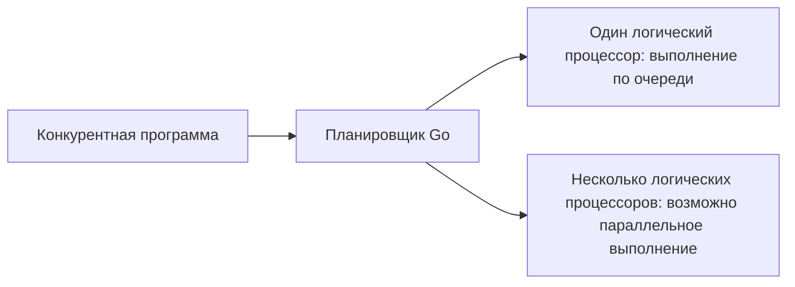

# Конкурентность и параллельное программирование

Кажется, что на компьютере одновременно работают браузер, музыкальный плеер, редактор кода и другие программы. На самом деле за этим стоят несколько разных механизмов.

Некоторые задачи выполняются на CPU по очереди. Если одна задача временно переходит в ожидание, вместо неё может работать другая. В другом случае несколько ядер CPU действительно выполняют разные задачи в один и тот же момент.

Для понимания этих двух ситуаций важны понятия `concurrency` (конкурентность) и `parallelism` (параллелизм).

В этом уроке мы по шагам рассмотрим:

* разницу между конкурентностью и параллелизмом;
* понятия CPU, ядра и логического процессора;
* работу, ограниченную вводом-выводом (I/O-bound) и процессором (CPU-bound);
* разницу между процессом, потоком и горутиной;
* как работает планировщик Go runtime;
* чем управляет `GOMAXPROCS`;
* как в общей памяти возникает гонка данных (data race);
* частые ошибки в конкурентных программах.

## CPU, ядро и логический процессор

CPU выполняет инструкции программы. Современный CPU обычно имеет несколько физических ядер.

Каждое физическое ядро может выполнять отдельные инструкции одновременно с другим ядром. Например, при четырёх физических ядрах в подходящих условиях несколько вычислений могут выполняться одновременно.

Но количество физических ядер и количество CPU, которое видит операционная система, не всегда совпадают.

На некоторых процессорах одно физическое ядро может вести несколько аппаратных потоков, то есть **hardware thread**. Такая технология обычно называется **SMT — Simultaneous Multithreading**.

Операционная система часто показывает программам не физические ядра, а **логические процессоры**.

Например, на компьютере может отображаться:

```text
8 логических процессоров
```

Это не значит, что восемь независимых задач всегда работают в восемь раз быстрее.

Причина в том, что задачи используют не только время CPU, но и другие общие ресурсы. Например:

* кеш CPU;
* оперативную память;
* пропускную способность памяти;
* диск;
* сеть;
* другие аппаратные ресурсы.

Поэтому параллельная работа может и мешать друг другу.

**Планировщик** (scheduler) операционной системы распределяет готовые к выполнению потоки по доступным логическим процессорам.

Важно, что каждое окно браузера или каждая работающая программа не закрепляется навсегда за отдельным ядром CPU.

Например, поток может сначала работать на первом ядре, а затем по решению планировщика продолжить на другом.

Значит, связь между ядрами CPU и выполняемыми задачами не постоянна. Операционная система может перераспределять их во время выполнения.

## Работа, ограниченная вводом-выводом и процессором

Не вся работа в программе одинакова по характеру.

Её полезно разделить на две большие группы в зависимости от того, на что тратится большая часть времени:

* I/O-bound работа;
* CPU-bound работа.

Эта разница очень важна для понимания того, где можно получить пользу от конкурентности или параллелизма.

### I/O-bound работа

**I/O-bound** работа тратит большую часть времени не на вычисления на CPU, а на ожидание завершения внешней операции.

Например:

* ожидание ответа на HTTP-запрос;
* ожидание результата из базы данных;
* чтение данных из файла;
* запись в файл;
* ожидание поступления данных через сокет;
* получение ввода от пользователя.

Например, программа отправила HTTP-запрос на другой сервер:

```text
Программа -> HTTP-запрос -> Сеть -> Другой сервер
```

После отправки запроса программа не получает результат сразу. Нужно время, чтобы ответ вернулся по сети.

Большую часть этого ожидания CPU не выполняет активных вычислений для этой задачи.

Если программа построена конкурентно, пока одна задача ждёт ответа сети, CPU может выполнять другую задачу.

Например:

```text
Задача 1: ждёт HTTP-ответа
Задача 2: обрабатывает результат из базы данных
Задача 3: принимает новый запрос
```

Поэтому конкурентность особенно полезна:

* в backend-серверах;
* в сетевых программах;
* в программах, много работающих с базами данных;
* в системах с множеством независимых операций ввода-вывода.

Главная польза здесь не всегда в ускорении одной операции. Часто цель — занять CPU другой полезной работой, а не держать его в праздном ожидании.

### CPU-bound работа

**CPU-bound** работа тратит большую часть времени на настоящие вычисления.

Например:

* обработка изображений;
* кодирование видео;
* сжатие данных;
* криптографические вычисления;
* математические вычисления над большими числами;
* выполнение сложного алгоритма над большими массивами.

В такой задаче CPU почти всегда занят.

Если вычисление можно разбить на независимые части и на компьютере несколько ядер CPU, параллельное выполнение может сократить общее время.

Например:

```text
Большое вычисление
    |
    +-- часть 1 -> CPU 1
    +-- часть 2 -> CPU 2
    +-- часть 3 -> CPU 3
    +-- часть 4 -> CPU 4
```

Но здесь есть важное ограничение.

У параллельной работы тоже есть своя цена:

* разбиение задач на части;
* управление горутинами или потоками;
* передача данных;
* блокировки и другая синхронизация;
* объединение результатов;
* затраты, связанные с кешем CPU;
* работа планировщика.

Поэтому распараллеливание очень маленького вычисления иногда может оказаться даже медленнее последовательного выполнения.

Значит, правила «больше параллелизма = всегда быстрее» не существует.

Это нужно измерять бенчмарками и профилированием.

## Процесс, поток и горутина

В теме конкурентности нужно различать понятия `process`, `thread` и `goroutine`.

Они связаны, но это не одно и то же.

### Процесс

**Процесс** (`process`) — экземпляр программы, запущенный операционной системой.

Например, если запустить программу в терминале:

```bash
./server
```

операционная система создаёт для неё процесс.

Каждый процесс обычно работает со своими:

* виртуальным адресным пространством;
* файловыми дескрипторами;
* ресурсами операционной системы;
* состоянием выполнения.

Один процесс не обращается напрямую к обычной памяти другого процесса.

Для обмена данными между процессами нужны особые средства. Например:

* сеть;
* pipe;
* сокет;
* разделяемая память (shared memory);
* другие механизмы IPC.

### Поток

**Поток** (`thread`) — единица выполнения операционной системы внутри процесса.

В одном процессе может быть несколько потоков.

Они разделяют общие ресурсы процесса. Например, потоки одного процесса обычно могут обращаться к:

* одному и тому же коду;
* одной и той же памяти кучи (heap);
* общим глобальным данным.

Но у каждого потока есть свои:

* стек;
* состояние выполняемой инструкции;
* состояние регистров.

Общая память упрощает обмен данными между потоками.

Но вместе с этим появляется и опасность.

Если два потока одновременно изменяют общую переменную без правильной синхронизации, может возникнуть гонка данных.

### Горутина

**Горутина** (goroutine) — лёгкая единица выполнения, которой управляет Go runtime.

Горутину не нужно приравнивать к потоку операционной системы.

Например, когда мы пишем:

```go
go doWork()
```

Go не обязан создавать отдельный поток операционной системы для каждого `doWork()`.

Вместо этого Go runtime может планировать множество горутин на меньшем количестве потоков операционной системы.

Упрощённый вид:

```text
Goroutine 1 ─┐
Goroutine 2 ─┼──> Go runtime scheduler ──> OS threads
Goroutine 3 ─┤
Goroutine 4 ─┘
```

Поэтому в Go-программе могут быть тысячи горутин, но это не значит, что существуют тысячи потоков ОС.

Следующая таблица кратко показывает разницу:

| Понятие  | Кто управляет?       | Особенность памяти                                       |
| -------- | -------------------- | -------------------------------------------------------- |
| Процесс  | Операционная система | Отдельное виртуальное адресное пространство              |
| Поток    | Операционная система | Разделяет память процесса с другими потоками             |
| Горутина | Go runtime           | Разделяет память процесса, имеет маленький растущий стек |

Создание горутины обычно дешевле создания потока операционной системы.

Но это не значит, что горутина совершенно бесплатна.

Каждой горутине нужны как минимум:

* стек;
* состояние runtime;
* данные, связанные с планировщиком;
* другие используемые ресурсы.

Поэтому бесконтрольное создание огромного количества горутин может вызвать проблемы.

Например, неуправляемая модель вроде:

```text
1 запрос -> 1000 горутин
1000 запросов -> 1 000 000 горутин
```

может резко увеличить расход памяти.

Кроме того, если горутина никогда не завершается, может возникнуть **утечка горутин** (goroutine leak).

## Разница между конкурентностью и параллелизмом

`Concurrency` и `parallelism` часто используют как синонимы. Но это не одно и то же.

### Конкурентность

**Конкурентность** (concurrency) — структура программы, которая управляет несколькими независимыми задачами в течение одного периода времени.

Эти задачи не обязаны выполняться ровно одновременно.

Например, одно ядро CPU может работать так:

```text
Время --->

A A A | B B | A A | C C | B B
```

Здесь:

* некоторое время выполняется `A`;
* затем `B`;
* затем снова `A`;
* затем `C`.

В каждый момент на CPU может работать только одна задача. Но несколько задач по очереди продвигаются вперёд в пределах одного интервала времени.

Это и есть конкурентность.

### Параллелизм

**Параллелизм** (parallelism) — выполнение двух или более задач действительно в один и тот же момент.

Например, если есть два логических процессора:

```text
CPU 1: A A A A A
CPU 2: B B B B B
```

задачи `A` и `B` могут выполняться одновременно.

Это и есть параллелизм.

Для параллелизма нужно несколько логических процессоров.

### Пример с кофейней

Посмотрим на разницу на простом примере.

Представьте, что в кофейне работает один сотрудник.

Он:

1. принимает заказ первого клиента;
2. запускает кофемашину;
3. вместо того чтобы ждать, пока кофе будет готов, принимает заказ второго клиента;
4. затем возвращается к первому заказу.

Это **конкурентность**.

Один сотрудник по очереди управляет несколькими делами.

Теперь представим, что сотрудников двое.

Первый сотрудник работает над первым заказом, а второй в тот же момент — над вторым.

Это **параллелизм**.

Посмотрим на разницу в таблице:

| Свойство                  | Конкурентность                            | Параллелизм                              |
| ------------------------- | ----------------------------------------- | ---------------------------------------- |
| Главная цель              | Эффективно управлять несколькими делами   | Выполнять несколько дел одновременно     |
| Работает ли на одном ядре | Да                                        | Нет                                      |
| Типичная задача           | Серверные запросы, ожидающие ввода-вывода | Вычисления, требующие CPU                |
| Главная польза            | Отзывчивость и использование ресурсов     | Сокращение времени вычислений            |

Самое важное различие здесь такое:

> Конкурентность больше относится к тому, как устроена программа. А параллелизм — к тому, как задачи выполняются в конкретный момент.

Программа, написанная конкурентно, не обязана всегда работать параллельно.

Например, если есть один логический процессор, горутины могут выполняться по очереди.

Если логических процессоров несколько, некоторые из них могут выполняться параллельно.



## Первая конкурентная программа на Go

Следующая программа изображает получение данных от трёх разных сервисов.

Вместо отправки запроса на настоящий сервер ожидание сети или другого ввода-вывода искусственно показано через `time.Sleep`.

```go
package main

import (
	"fmt"
	"sync"
	"time"
)

func fetch(service string, delay time.Duration) string {
	time.Sleep(delay)
	return service + ": ответ"
}

func main() {
	services := []string{"профиль", "заказы", "рекомендации"}
	delays := []time.Duration{
		30 * time.Millisecond,
		10 * time.Millisecond,
		20 * time.Millisecond,
	}
	results := make([]string, len(services))

	var wg sync.WaitGroup

	for i, service := range services {
		wg.Add(1)

		go func() {
			defer wg.Done()
			results[i] = fetch(service, delays[i])
		}()
	}

	wg.Wait()

	for _, result := range results {
		fmt.Println(result)
	}
}
```

Результат:

```text
профиль: ответ
заказы: ответ
рекомендации: ответ
```

Теперь разберём код по шагам.

Первый slice хранит названия сервисов:

```go
services := []string{"профиль", "заказы", "рекомендации"}
```

Второй slice показывает, сколько ждёт каждый сервис:

```go
delays := []time.Duration{
	30 * time.Millisecond,
	10 * time.Millisecond,
	20 * time.Millisecond,
}
```

Значит:

```text
профиль       -> 30 ms
заказы        -> 10 ms
рекомендации  -> 20 ms
```

Для результатов заранее создаётся slice из трёх элементов:

```go
results := make([]string, len(services))
```

Здесь индекс используется, чтобы сохранять результаты именно в порядке сервисов.

Затем создаётся `WaitGroup`:

```go
var wg sync.WaitGroup
```

Перед началом каждой работы вызывается:

```go
wg.Add(1)
```

Это сообщает `WaitGroup`:

> Есть ещё одна работа, завершения которой нужно дождаться.

Затем анонимная функция запускается в новой горутине:

```go
go func() {
	...
}()
```

Первая важная строка внутри горутины:

```go
defer wg.Done()
```

`wg.Done()` сообщает, что эта работа завершена.

Из-за `defer` он вызывается при завершении функции.

Затем выполняется настоящая работа:

```go
results[i] = fetch(service, delays[i])
```

Каждая горутина записывает результат по своему индексу.

Например:

```text
профиль       -> results[0]
заказы        -> results[1]
рекомендации  -> results[2]
```

Поэтому, даже если сервисы завершаются в разное время, результаты записываются в заранее определённые места slice.

А функция `main` в строке:

```go
wg.Wait()
```

ждёт завершения всех горутин.

Только после этого:

```go
for _, result := range results {
	fmt.Println(result)
}
```

выводит результаты.

Поэтому вывод идёт не в порядке завершения, а в порядке slice `results`:

```text
профиль: ответ
заказы: ответ
рекомендации: ответ
```

На самом деле `заказы` ждёт всего `10 ms` и может завершиться раньше, чем `профиль`.

Если бы `fmt.Println` вызывался прямо внутри горутины, результаты могли бы выводиться в другом порядке.

Например:

```text
заказы: ответ
рекомендации: ответ
профиль: ответ
```

Планировщик не гарантирует строгий порядок выполнения.

В этом примере время ожидания трёх работ перекрывается:

```text
профиль:       |---------- 30 ms ----------|
заказы:        |-- 10 ms --|
рекомендации:  |------ 20 ms ------|
```

Поэтому вместо последовательных:

```text
30 + 10 + 20 = 60 ms
```

общее время может приблизиться к самой медленной операции:

```text
max(30, 10, 20) ≈ 30 ms
```

Но это не точная гарантия времени.

Есть и затраты планировщика, операционной системы и другие затраты runtime. Чтобы определить реальную скорость, нужен бенчмарк или другое измерение.

> **Информация**
>
> Горутины и `WaitGroup` изучались в предыдущих уроках. Каналы будут отдельно рассмотрены в следующих уроках. Здесь
> они используются вместе, чтобы на практическом примере показать разницу между конкурентностью и параллелизмом.

## Углубление: как работает планировщик Go?

Чтобы начать работать с конкурентностью, не нужно заучивать внутреннюю модель планировщика. Следующий раздел — для читателей, которые хотят глубже понять, как горутины планируются на уровне runtime.

В Go runtime есть планировщик, который размещает горутины для выполнения.

Его часто объясняют через **модель G–M–P**.

В этой модели:

* **G** — горутина;
* **M** — поток операционной системы;
* **P** — ресурс runtime, необходимый для выполнения Go-кода.

Упрощённый вид:

```text
Горутины
    |
    v
    P
    |
    v
OS thread (M)
    |
    v
CPU
```

Или, если работ несколько:

```text
G1 ─┐
G2 ─┤
G3 ─┼──> P ───> M ───> CPU
G4 ─┤
G5 ─┘
```

Планировщик привязывает готовые к выполнению горутины к `M` через `P`.

Цель этой модели — эффективно выполнять множество горутин на меньшем количестве потоков операционной системы.

Например, горутина может перейти в ожидание из-за одной из следующих операций:

* операция с каналом;
* mutex;
* таймер;
* сетевой ввод-вывод;
* другая блокирующая работа.

Пока одна горутина ждёт, runtime может попытаться выполнить другую готовую горутину, вместо того чтобы впустую тратить доступное время CPU.

Например:

```text
G1 -> ждёт ответа сети
G2 -> готова к выполнению
```

В такой момент планировщик может запустить `G2`.

При некоторых блокирующих системных вызовах сам поток ОС может оставаться занятым. В таком случае runtime может использовать другой поток и продолжить выполнение других горутин.

### `GOMAXPROCS`

В Go runtime есть важное понятие `runtime.GOMAXPROCS`.

Оно задаёт количество `P`, которые могут одновременно участвовать в выполнении Go-кода.

Здесь есть распространённая путаница:

> `GOMAXPROCS` не ограничивает количество горутин.

Например, в программе может быть:

```text
1000 горутин
```

Но если `GOMAXPROCS` равен:

```text
4
```

возможность параллельно выполнять Go-код в конкретный момент ограничена количеством `P`.

Упрощённо:

```text
1000 горутин
      |
      v
4 P
      |
      v
параллельное выполнение Go
```

Текущее количество CPU и значение `GOMAXPROCS` можно посмотреть так:

```go
package main

import (
	"fmt"
	"runtime"
)

func main() {
	fmt.Println("Логических CPU:", runtime.NumCPU())
	fmt.Println("GOMAXPROCS:", runtime.GOMAXPROCS(0))
}
```

Например, результат может быть таким:

```text
Логических CPU: 8
GOMAXPROCS: 8
```

Но эти значения зависят от компьютера и среды, в которой работает программа.

Следующая строка:

```go
runtime.NumCPU()
```

возвращает количество логических CPU, которое видит Go runtime.

А эта строка:

```go
runtime.GOMAXPROCS(0)
```

возвращает текущее значение `GOMAXPROCS`.

Здесь значение `0` используется в смысле:

> Не устанавливай новый лимит, просто верни текущее значение.

> **Внимание**
>
> Увеличение `GOMAXPROCS` сверх количества логических CPU не ускоряет автоматически CPU-bound код. Наоборот, лишний параллелизм может увеличить работу планировщика, переключения контекста и затраты, связанные с кешем CPU.

## Общая память и гонки данных

Горутины работают внутри одного процесса.

Поэтому они разделяют память процесса.

Это очень удобно. Например, несколько горутин могут работать с одним и тем же slice, map или struct.

Но при работе с общей памятью важна синхронизация.

Если:

1. две или более горутины обращаются к одному и тому же месту памяти;
2. хотя бы одна из них выполняет запись;
3. между ними нет необходимой синхронизации;

может возникнуть **гонка данных** (data race).

Следующий код намеренно неправильный:

```go
// Неправильный пример: несколько горутин пишут в count
// без синхронизации.
// count++ — не одна атомарная операция.
// go func() {
//     count++
// }()
```

На первый взгляд:

```go
count++
```

похоже на одну операцию.

Но концептуально её можно разбить на такие шаги:

```text
1. прочитать значение count
2. увеличить значение на 1
3. записать новое значение в count
```

Например, пусть `count = 0`.

Если две горутины работают одновременно:

```text
G1: прочитала count -> 0
G2: прочитала count -> 0

G1: 0 + 1 -> 1
G2: 0 + 1 -> 1

G1: count = 1
G2: count = 1
```

Мы думали, что выполнены два увеличения.

Ожидаемый результат:

```text
2
```

Но при некоторых выполнениях результат может быть:

```text
1
```

Это приводит к проблемам вроде **потерянного обновления** (lost update).

Ещё один важный момент:

> То, что программа несколько раз вывела правильный результат, не доказывает отсутствие гонок.

Гонка данных может зависеть от конкретного порядка выполнения, выбранного планировщиком.

Для безопасного управления общим состоянием есть разные подходы.

Например:

* передать состояние одной горутине через канал;
* `sync.Mutex`;
* `sync.RWMutex`;
* `sync/atomic`;
* другие подходящие механизмы синхронизации.

Race detector в Go тоже помогает находить проблемы с гонками.

Запуск тестов с race detector:

```bash
go test -race ./...
```

Запуск обычной программы с race detector:

```bash
go run -race main.go
```

Если во время выполнения замечена гонка данных, race detector может сообщить об этом.

Но здесь есть важное ограничение.

Race detector не проверяет автоматически все теоретические пути выполнения. Он анализирует обращения к памяти, замеченные во время реального выполнения программы.

Поэтому:

```text
Race detector не нашёл ошибок
```

не является гарантией того, что:

```text
Гонка данных в программе совершенно невозможна
```

Тесты должны также выполнять путь кода, на котором возникает гонка.

## Частые ошибки

При написании конкурентных программ очень часто встречаются несколько ошибок.

### Приравнивание конкурентности к скорости

Добавление горутин не ускоряет код автоматически.

Например, следующая мысль неверна:

```text
1 горутина — хорошо
10 горутин — быстрее
1000 горутин — ещё быстрее
```

На реальную скорость влияет множество факторов:

* код, который обязан выполняться последовательно;
* блокировки;
* передача данных;
* планировщик;
* выделение памяти;
* кеш CPU;
* ограничения ввода-вывода;
* лимиты внешних сервисов.

В CPU-bound работе дополнительные горутины могут помочь использовать доступное количество CPU.

Но создание слишком большого количества параллельной работы, наоборот, увеличивает накладные расходы.

В I/O-bound работе конкурентность часто помогает перекрыть время ожидания.

Поэтому практический подход обычно такой:

```text
1. Сначала написать простое и правильное решение
2. Сделать бенчмарк или профилирование
3. Найти узкое место
4. Применить конкурентность только там, где нужно
5. Снова измерить
```

### Неограниченное создание горутин

Создавать горутину для каждой работы без контроля опасно.

Например:

```go
for item := range items {
	go process(item)
}
```

если `items` очень много, одновременно может быть создано огромное количество горутин.

Это нагружает не только память процесса Go, но и внешние системы.

Например:

* заканчиваются соединения с базой данных;
* упираемся в rate limit внешнего API;
* заканчиваются файловые дескрипторы;
* резко растёт расход памяти;
* растёт нагрузка на планировщик.

Поэтому количество одновременно выполняемых работ нужно ограничивать.

Для этого часто используют подходы вроде:

* семафора;
* worker pool;
* ограниченной очереди (bounded queue).

Например, в системе может быть 100 000 задач. Но одновременно могут выполняться только 20 из них.

```text
100 000 задач
     |
     v
очередь
     |
     v
20 воркеров
```

Это помогает использовать ресурсы контролируемо.

### Не дождаться завершения горутин

В Go-программе, когда функция `main` возвращается, процесс завершается.

Runtime не ждёт оставшиеся горутины автоматически, как бы говоря:

> Подожду, пока все закончат свою работу.

Например:

```go
func main() {
	go doWork()
}
```

Если `main()` завершится очень быстро, `doWork()` может не успеть закончиться.

Поэтому завершения горутин нужно дожидаться явным механизмом синхронизации.

Например:

* `sync.WaitGroup`;
* канал;
* другой подходящий способ координации.

А следующий приём — не надёжная синхронизация:

```go
time.Sleep(time.Second)
```

Здесь программа предполагает:

> Одной секунды, наверное, хватит.

Но работа иногда может длиться `500 ms`, а иногда `2 s`.

Правильное решение должно ждать настоящего сигнала завершения работы.

### Утечка горутин

**Утечка горутин** (goroutine leak) — ситуация, когда горутина никогда не завершается, хотя уже не выполняет полезной работы.

Например, горутина ждёт значение из канала:

```go
value := <-ch
```

Но никто никогда не отправляет значение в `ch`.

В результате горутина может навсегда остаться в ожидании.

Похожие проблемы могут возникать и при:

* вводе-выводе, который никогда не завершается;
* сигнале, который никогда не отправляется;
* повторных попытках (retry), которые никогда не останавливаются;
* воркере, который так и не закрыли;
* внешнем вызове без тайм-аута.

Горутина может не использовать CPU, но всё равно удерживает состояние runtime и другие ресурсы.

В backend-программах для долгих работ важно чётко определять механизмы:

* отмены (cancellation);
* крайнего срока (deadline);
* тайм-аута (timeout).

В Go для этого часто используют `context.Context`.

### Опора на порядок результатов

Планировщик не гарантирует порядок выполнения горутин.

Например, если написано:

```go
go first()
go second()
```

это не значит:

```text
first обязательно полностью завершится
затем выполнится second
```

Даже если горутина `first` создана раньше, `second` может вывести результат первой.

Логику конкурентной программы нельзя привязывать к случайному порядку планировщика.

Если нужен определённый порядок, его нужно явно задать в программе.

Например, с помощью:

* канала;
* `WaitGroup`;
* индекса;
* mutex;
* другого механизма координации.

## Правильная оценка производительности

Прежде чем выбирать параллельное или конкурентное решение, нужно понять реальный характер кода.

Полезны следующие вопросы:

* Работа I/O-bound или CPU-bound?
* Можно ли разбить задачи на независимые части?
* Зависит ли одна часть от результата другой?
* Используется ли общая память?
* Безопасен ли доступ к общей памяти?
* Ограничено ли количество параллельных работ?
* Сколько параллельных запросов выдержит внешний сервис?
* Как распространяются ошибки?
* Как работает тайм-аут?
* Как доставляется сигнал отмены?
* Чем последовательный и конкурентный варианты отличаются в бенчмарке?

При оценке скорости важно также различать понятия **latency** (задержка) и **throughput** (пропускная способность).

### Задержка

**Latency** — время от начала одной операции или запроса до её завершения.

Например:

```text
Запрос начался:   10:00:00.000
Запрос завершён:  10:00:00.050
```

Задержка:

```text
50 ms
```

### Пропускная способность

**Throughput** показывает, сколько работы выполнено за определённое время.

Например:

```text
1000 запросов / секунду
```

Это пропускная способность.

Конкурентность иногда почти не меняет задержку одного запроса, но может увеличить пропускную способность системы.

Например, каждый запрос ждёт внешний сервис `50 ms`.

Задержка одного запроса по-прежнему может быть примерно:

```text
50 ms
```

Но если сервер может одновременно держать в ожидании много запросов, количество запросов, выполняемых за секунду, может вырасти.

Поэтому:

> Задержка улучшилась.

и:

> Пропускная способность улучшилась.

— это не одно и то же утверждение.

Улучшение одного не всегда улучшает другое.

## На что обращают внимание на собеседовании?

В вопросах на собеседовании по конкурентности обычно важны не только определения, но и понимание разницы между понятиями.

Нужно уметь чётко объяснить следующие мысли.

**Конкурентность — структура программы, а параллелизм — свойство выполнения.**

Конкурентная программа управляет несколькими задачами в течение одного периода. Они могут выполняться и по очереди на одном CPU.

Параллелизм означает выполнение нескольких задач в один и тот же момент.

**Горутина — не поток операционной системы.**

Горутинами управляет Go runtime. Runtime планирует множество горутин на потоках ОС.

**`GOMAXPROCS` не ограничивает количество горутин.**

В программе может быть очень много горутин. А `GOMAXPROCS` влияет на количество `P`, которые могут одновременно участвовать в параллельном выполнении Go-кода.

**Запись в общую память без синхронизации может вызвать гонку данных.**

Особенно если несколько горутин изменяют одно и то же значение, нужна правильная синхронизация.

**Конкурентность не гарантирует скорость.**

Добавление горутин само по себе не является оптимизацией. Любой вывод о скорости нужно проверять бенчмарком или профилированием.

**Количество горутин нужно контролировать.**

Бесконтрольное создание горутин может исчерпать память, соединения с базой данных, внешний сервис или другие ресурсы.

## Примеры

### 1. Измерение времени последовательного выполнения

Этот пример выполняет две работы последовательно.

Цель — увидеть базовое время для сравнения со следующим конкурентным примером.

```go
package main

import (
	"fmt"
	"time"
)

func work(name string) {
	time.Sleep(100 * time.Millisecond)
	fmt.Println(name, "завершена")
}

func main() {
	started := time.Now()

	work("первая работа")
	work("вторая работа")

	fmt.Println("Общее время:", time.Since(started))
}
```

Функция `work()` ждёт `100` миллисекунд через строку:

```go
time.Sleep(100 * time.Millisecond)
```

Пока первый вызов:

```go
work("первая работа")
```

не завершится, следующая строка не выполняется.

После этого начинается:

```go
work("вторая работа")
```

Если упрощённо показать течение времени:

```text
первая работа: |-------- 100 ms --------|
вторая работа:                           |-------- 100 ms --------|
```

Поэтому общее ожидание примерно:

```text
100 ms + 100 ms = 200 ms
```

Вывод примерно такой:

```text
первая работа завершена
вторая работа завершена
Общее время: 200...
```

Точное значение не обязательно ровно `200 ms`. Из-за планировщика и других системных затрат оно может быть немного больше.

Главное правило в этом примере:

> При последовательном выполнении вторая работа не начинается, пока не завершится первая.

### 2. Перекрытие времени ожидания

В этом примере две ожидающие работы запускаются в отдельных горутинах.

```go
package main

import (
	"fmt"
	"time"
)

func waitForService(name string) {
	time.Sleep(100 * time.Millisecond)
	fmt.Println(name, "ответил")
}

func main() {
	started := time.Now()

	go waitForService("API")
	go waitForService("база данных")

	time.Sleep(150 * time.Millisecond)
	fmt.Println("Прошло времени:", time.Since(started))
}
```

На этот раз:

```go
go waitForService("API")
```

и:

```go
go waitForService("база данных")
```

запускаются в отдельных горутинах.

Поэтому два ожидания по `100 ms` могут идти не одно за другим, а в одном интервале времени:

```text
API:          |-------- 100 ms --------|
база данных:  |-------- 100 ms --------|
```

В последовательном варианте общее ожидание было:

```text
100 + 100 = 200 ms
```

В конкурентном случае два ожидания перекрываются. Поэтому обе работы могут завершиться примерно через `100 ms`.

Строка в коде:

```go
time.Sleep(150 * time.Millisecond)
```

поставлена, чтобы дождаться завершения горутин.

Но это не правильный способ синхронизации для реальной программы.

Причина в том, что `Sleep()` не говорит:

> Жди, пока работа завершится.

Он говорит только:

> Жди указанное время.

В реальном коде нужно использовать `WaitGroup`, канал или другой явный способ синхронизации.

Главное правило в этом примере:

> Если независимые ожидающие работы, например ввод-вывод, запущены конкурентно, их время ожидания может перекрываться.

### 3. Просмотр количества логических процессоров

В этом примере выводится количество логических процессоров, которое видит Go runtime.

```go
package main

import (
	"fmt"
	"runtime"
)

func main() {
	logicalCPU := runtime.NumCPU()
	fmt.Println("Логических процессоров:", logicalCPU)
}
```

Главная строка:

```go
logicalCPU := runtime.NumCPU()
```

`runtime.NumCPU()` возвращает количество логических CPU, которое Go runtime видит в среде выполнения программы.

Например, может вывестись:

```text
Логических процессоров: 8
```

На другом компьютере может быть:

```text
Логических процессоров: 4
```

Значение зависит от среды, в которой работает программа.

Это число не нужно приравнивать к количеству горутин.

Например, даже если есть:

```text
8 логических CPU
```

в программе может быть:

```text
10 000 горутин
```

Горутины планируются по логическим CPU силами Go runtime.

Главное правило в этом примере:

> Количество логических CPU — не количество горутин. Оно выражает аппаратные возможности и возможности выполнения runtime.

### 4. Чтение значения `GOMAXPROCS`

В этом примере показывается значение `GOMAXPROCS`, используемое для одновременного выполнения Go-кода.

```go
package main

import (
	"fmt"
	"runtime"
)

func main() {
	current := runtime.GOMAXPROCS(0)
	fmt.Println("GOMAXPROCS:", current)
}
```

Главная строка:

```go
current := runtime.GOMAXPROCS(0)
```

Здесь `0` не устанавливает новое значение.

Он только запрашивает текущее значение `GOMAXPROCS`.

Например, может вывестись:

```text
GOMAXPROCS: 8
```

`GOMAXPROCS` не ограничивает количество горутин.

Например, может быть:

```text
Количество горутин: 5000
GOMAXPROCS:         8
```

В этом случае существует 5000 горутин, но не все они в один момент параллельно выполняют Go-код.

Главное правило в этом примере:

> `GOMAXPROCS` управляет не количеством горутин, а возможностью параллельного выполнения Go.

### 5. Добровольная передача очереди планировщику

В этом примере используется `runtime.Gosched()`.

```go
package main

import (
	"fmt"
	"runtime"
	"time"
)

func main() {
	go func() {
		fmt.Println("Вспомогательная горутина выполнилась")
	}()

	runtime.Gosched()

	time.Sleep(10 * time.Millisecond)
	fmt.Println("main завершилась")
}
```

Сначала создаётся вспомогательная горутина:

```go
go func() {
	fmt.Println("Вспомогательная горутина выполнилась")
}()
```

Затем вызывается:

```go
runtime.Gosched()
```

`Gosched()` не завершает текущую горутину.

Он даёт планировщику возможность выполнить другие готовые горутины.

Упрощённо:

```text
main работает
     |
     v
Gosched()
     |
     v
планировщик может запустить другую готовую горутину
```

Но `Gosched()` — не средство синхронизации, гарантирующее строгий порядок выполнения.

Строка в коде:

```go
time.Sleep(10 * time.Millisecond)
```

оставлена только для того, чтобы увидеть вывод небольшого примера.

В реальной программе порядок или завершение задач не должны зависеть от предположений о `Gosched()` и `Sleep()`.

Главное правило в этом примере:

> `runtime.Gosched()` даёт планировщику возможность выполнить другие горутины, но не гарантирует порядок выполнения.

### 6. Конкурентный запуск независимых вычислений

В этом примере два не зависящих друг от друга вычисления выполняются в отдельных горутинах.

```go
package main

import (
	"fmt"
	"time"
)

func square(number int) {
	fmt.Println(number, "в квадрате:", number*number)
}

func cube(number int) {
	fmt.Println(number, "в кубе:", number*number*number)
}

func main() {
	go square(4)
	go cube(3)

	time.Sleep(20 * time.Millisecond)
}
```

Первая функция:

```go
square(4)
```

выполняет вычисление:

```text
4 * 4 = 16
```

Вторая функция:

```go
cube(3)
```

выполняет вычисление:

```text
3 * 3 * 3 = 27
```

Эти два вычисления не зависят друг от друга.

Результат `square(4)` не нужен для `cube(3)`. Результат `cube(3)` тоже не нужен для `square(4)`.

Поэтому их можно запустить в независимых горутинах:

```go
go square(4)
go cube(3)
```

Вывод может быть таким:

```text
4 в квадрате: 16
3 в кубе: 27
```

Но возможен и обратный порядок:

```text
3 в кубе: 27
4 в квадрате: 16
```

Причина в том, что планировщик не гарантирует, какая горутина выполнится первой.

Главное правило в этом примере:

> Независимые работы можно запускать конкурентно, но нельзя полагаться на порядок их завершения.

### 7. Не полагаться на порядок планировщика

В этом примере две горутины ждут разное время.

```go
package main

import (
	"fmt"
	"time"
)

func task(name string, delay time.Duration) {
	time.Sleep(delay)
	fmt.Println(name)
}

func main() {
	go task("медленная", 60*time.Millisecond)
	go task("быстрая", 10*time.Millisecond)

	time.Sleep(80 * time.Millisecond)
}
```

В коде горутина `медленная` написана первой:

```go
go task("медленная", 60*time.Millisecond)
```

Затем создана горутина `быстрая`:

```go
go task("быстрая", 10*time.Millisecond)
```

Но их время ожидания разное:

```text
медленная -> 60 ms
быстрая   -> 10 ms
```

Шкала времени:

```text
медленная: |---------------- 60 ms ----------------|
быстрая:   |--- 10 ms ---|
```

Поэтому `быстрая` обычно выводится первой:

```text
быстрая
медленная
```

Это очень важное правило.

То, что горутина написана в коде раньше, не значит, что она раньше завершится.

Вообще, конкурентный код нельзя строить на предположении:

```text
Эта горутина написана первой, значит, она первой и завершится.
```

Если порядок нужен, его нужно отдельно синхронизировать.

Главное правило в этом примере:

> Порядок записи горутин в коде не гарантирует порядок их завершения.

### 8. Гонка данных в общей памяти

В этом примере две горутины изменяют одно и то же значение `counter` без синхронизации.

```go
package main

import (
	"fmt"
	"time"
)

func main() {
	counter := 0

	go func() {
		counter++
	}()

	go func() {
		counter++
	}()

	time.Sleep(20 * time.Millisecond)
	fmt.Println(counter)
}
```

`counter` в начальном состоянии:

```text
0
```

Первая горутина выполняет:

```go
counter++
```

Вторая горутина тоже выполняет с той же общей переменной:

```go
counter++
```

Проблема в том, что с точки зрения общей памяти `counter++` нельзя считать одной неделимой операцией.

Концептуально в ней есть шаги:

```text
чтение
увеличение
запись
```

Например:

```text
counter = 0

G1: прочитала counter -> 0
G2: прочитала counter -> 0

G1: получила 1
G2: получила 1

G1: counter = 1
G2: counter = 1
```

В результате, хотя увеличений было два, итоговое значение может остаться `1`.

Кроме того, в этом коде `main` тоже читает `counter`:

```go
fmt.Println(counter)
```

Эти обращения сами по себе тоже не синхронизированы правильно.

Проблему можно увидеть с помощью race detector:

```bash
go run -race main.go
```

Строка в коде:

```go
time.Sleep(20 * time.Millisecond)
```

не устраняет гонку данных.

`Sleep()` лишь ждёт, пока пройдёт время. Он не создаёт необходимой синхронизации между обращениями к памяти.

Главное правило в этом примере:

> Конкурентная запись в одну и ту же общую память без синхронизации может вызвать гонку данных.

### 9. Запись в разные места памяти

В этом примере две горутины пишут в разные элементы одного slice.

```go
package main

import (
	"fmt"
	"time"
)

func main() {
	values := make([]int, 2)

	go func() {
		values[0] = 25
	}()

	go func() {
		values[1] = 50
	}()

	time.Sleep(20 * time.Millisecond)
	fmt.Println("Вычисления завершены")
}
```

Сначала создаётся slice длиной `2`:

```go
values := make([]int, 2)
```

В нём есть такие индексы:

```text
values[0]
values[1]
```

Первая горутина пишет:

```go
values[0] = 25
```

Вторая горутина пишет:

```go
values[1] = 50
```

Хотя эти две операции относятся к одному объекту slice, они пишут в два разных элемента:

```text
goroutine 1 -> values[0]
goroutine 2 -> values[1]
```

То есть они не пишут в одно и то же место памяти.

Кроме того, в этом примере `main()` не читает значения элементов, пока горутины пишут.

Он только выводит строку:

```go
fmt.Println("Вычисления завершены")
```

Поэтому этот пример отличается от предыдущего случая с `counter++`.

Но `time.Sleep()` и здесь не является средством правильной синхронизации завершения работы. В реальной программе нужно использовать явный сигнал завершения.

Главное правило в этом примере:

> Если разные горутины работают с независимыми местами памяти, проблемы конкурентной записи в одну переменную не возникает. Но завершение горутин всё равно нужно правильно синхронизировать.

### 10. Разделение задержки и пропускной способности

В этом примере показана разница между задержкой одной работы и общим временем выполнения нескольких конкурентных работ.

```go
package main

import (
	"fmt"
	"time"
)

func request(id int) {
	time.Sleep(50 * time.Millisecond)
	fmt.Println("Запрос завершён:", id)
}

func main() {
	started := time.Now()

	for id := 1; id <= 3; id++ {
		go request(id)
	}

	time.Sleep(80 * time.Millisecond)
	fmt.Println("Время на три запроса:", time.Since(started))
}
```

Каждая функция `request()` ждёт примерно `50 ms` через:

```go
time.Sleep(50 * time.Millisecond)
```

Значит, задержка одного запроса остаётся примерно:

```text
50 ms
```

Теперь представим, что три запроса выполняются последовательно:

```text
request 1: |---- 50 ms ----|
request 2:                  |---- 50 ms ----|
request 3:                                   |---- 50 ms ----|
```

Общее время было бы примерно:

```text
50 + 50 + 50 = 150 ms
```

Но в коде запросы запускаются конкурентно через горутины:

```go
for id := 1; id <= 3; id++ {
	go request(id)
}
```

Поэтому ожидания могут перекрываться:

```text
request 1: |---- 50 ms ----|
request 2: |---- 50 ms ----|
request 3: |---- 50 ms ----|
```

Задержка одного запроса остаётся около `50 ms`.

Но выполнение трёх запросов не складывается последовательно в `150 ms`.

Это может быть полезно с точки зрения пропускной способности: появляется возможность работать над большим количеством запросов в одном интервале времени.

В коде `id` начинается с `1`:

```go
for id := 1; id <= 3; id++ {
```

Технической необходимости в этом нет. Это выбрано только для того, чтобы вывести результат в удобном для читателя виде:

```text
Запрос завершён: 1
Запрос завершён: 2
Запрос завершён: 3
```

Ещё раз: в этом примере

```go
time.Sleep(80 * time.Millisecond)
```

используется только для небольшой демонстрации.

В реальной программе то, что три горутины действительно завершились, нужно определять через `WaitGroup`, канал или другой механизм синхронизации.

Главное правило в этом примере:

> Конкурентность может позволить выполнить больше работы за период времени, то есть увеличить пропускную способность, даже не меняя задержку одной операции.
